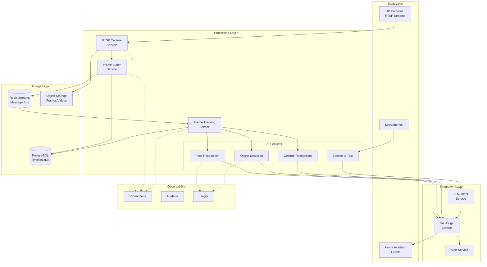
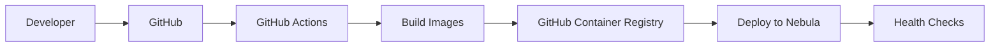

# 🏗️ Architektura Systemu Detektor

## Spis treści

1. [Wprowadzenie](#wprowadzenie)
2. [High-Level Architecture](#high-level-architecture)
3. [Komponenty Systemu](#komponenty-systemu)
4. [Flow Danych](#flow-danych)
5. [Bounded Contexts](#bounded-contexts)
6. [Technologie](#technologie)
7. [Deployment Architecture](#deployment-architecture)
8. [Security](#security)
9. [Monitoring & Observability](#monitoring--observability)
10. [Decyzje Architektoniczne](#decyzje-architektoniczne)

## Wprowadzenie

Detektor to system monitoringu wizyjnego oparty na mikroserwisach, zaprojektowany do przechwytywania i analizy strumieni wideo z kamer IP. System wykorzystuje AI/ML do rozpoznawania obiektów i integruje się z Home Assistant dla automatyzacji domowej.

### Kluczowe cechy

- **Event-driven architecture** z Redis Streams
- **Clean Architecture** i Domain-Driven Design
- **Observability-first** - pełne metryki, logi i tracing od początku
- **Container-first** - wszystko działa w Docker
- **GPU acceleration** dla operacji AI/ML

## High-Level Architecture



## Komponenty Systemu

### 1. Input Services

#### RTSP Capture Service (Port 8001)
- **Odpowiedzialność**: Przechwytywanie strumieni RTSP z kamer IP
- **Technologie**: Python, OpenCV, aiortc
- **Features**:
  - Multi-stream support
  - Automatic reconnection
  - Frame rate control
  - Motion detection
- **Metryki**: FPS, latency, dropped frames

#### Audio Capture Service (Planned)
- **Odpowiedzialność**: Przechwytywanie audio z mikrofonów
- **Technologie**: Python, PyAudio
- **Features**: Noise reduction, VAD (Voice Activity Detection)

### 2. Processing Services

#### Frame Buffer Service (Port 8002)
- **Odpowiedzialność**: Buforowanie i dystrybucja ramek
- **Technologie**: Python, Redis Streams
- **Features**:
  - High-throughput (80k fps)
  - Low latency (0.01ms)
  - DLQ (Dead Letter Queue)
  - Persistence

#### Frame Tracking (Dual Implementation)

**1. Frame Tracking Service (Port 8081)**
- **Odpowiedzialność**: Event sourcing dla audytu cyklu życia klatek
- **Technologie**: Python, FastAPI, PostgreSQL
- **Features**:
  - Event store dla wszystkich zdarzeń związanych z klatkami
  - Audit trail dla compliance
  - Query API dla historii klatek
  - Retention policies

**2. Frame Tracking Library (`services/shared/frame-tracking`)**
- **Odpowiedzialność**: Distributed tracing dla śledzenia klatek przez pipeline
- **Technologie**: Python, OpenTelemetry, W3C Trace Context
- **Features**:
  - Automatyczna propagacja trace context
  - Integracja z Jaeger
  - Zero network latency (in-process)
  - Graceful degradation

### 3. AI Services

#### Face Recognition Service (Port 8002)
- **Odpowiedzialność**: Rozpoznawanie twarzy
- **Technologie**: Python, InsightFace, dlib
- **Features**:
  - Face detection & recognition
  - Face embedding storage
  - Unknown face alerts

#### Object Detection Service (Port 8003)
- **Odpowiedzialność**: Detekcja obiektów
- **Technologie**: Python, YOLO v8
- **Features**:
  - 80+ object classes
  - Custom model support
  - GPU acceleration

#### Gesture Recognition Service (Planned)
- **Odpowiedzialność**: Rozpoznawanie gestów
- **Technologie**: Python, MediaPipe
- **Features**: Hand tracking, pose estimation

### 4. Integration Services

#### Home Assistant Bridge (Port 8004)
- **Odpowiedzialność**: Integracja z Home Assistant
- **Technologie**: Python, WebSocket, REST API
- **Features**:
  - Bidirectional communication
  - Entity creation
  - Automation triggers

#### LLM Intent Service (Planned)
- **Odpowiedzialność**: Przetwarzanie komend głosowych
- **Technologie**: Python, OpenAI/Anthropic API
- **Features**:
  - Intent recognition
  - Context management
  - Multi-language support

### 5. Infrastructure Services

#### Message Bus (Redis Streams)
- **Port**: 6379
- **Features**:
  - Event streaming
  - Consumer groups
  - Message persistence
  - Pub/Sub patterns

#### Database (PostgreSQL + TimescaleDB)
- **Port**: 5432
- **Features**:
  - Time-series data
  - Event sourcing
  - Metadata storage

#### Observability Stack
- **Prometheus** (9090): Metrics collection
- **Grafana** (3000): Dashboards
- **Jaeger** (16686): Distributed tracing

## Flow Danych

### 1. Video Processing Pipeline

```
Camera → RTSP Capture → Redis Streams → Frame Buffer → ??? → AI Services → HA Bridge → Home Assistant
                              ↓                          ↑
                         PostgreSQL                   (brak połączenia)
                         (metadata)
```

**⚠️ UWAGA: Pipeline niekompletny (2025-01-27)**
- Frame Buffer konsumuje z Redis Stream ale nic nie konsumuje z bufora
- Brak mechanizmu przekazywania klatek do AI Services
- Skutek: 100% frame loss po zapełnieniu bufora (1000 klatek)

### 2. Event Flow

```yaml
# Frame Captured Event
{
  "event_type": "frame.captured",
  "timestamp": "2024-01-20T10:00:00Z",
  "camera_id": "front_door",
  "frame_id": "uuid",
  "metadata": {
    "width": 1920,
    "height": 1080,
    "motion_detected": true
  }
}

# Object Detected Event
{
  "event_type": "object.detected",
  "timestamp": "2024-01-20T10:00:01Z",
  "frame_id": "uuid",
  "objects": [
    {
      "class": "person",
      "confidence": 0.95,
      "bbox": [100, 200, 300, 400],
      "track_id": "person_1"
    }
  ]
}
```

## Bounded Contexts

System jest podzielony na następujące bounded contexts zgodnie z DDD:

### 1. Frame Processing Context
- **Aggregates**: Frame, Camera, Stream
- **Services**: RTSP Capture, Frame Buffer
- **Events**: FrameCaptured, MotionDetected

### 2. AI Detection Context
- **Aggregates**: Detection, Track, Model
- **Services**: Face Recognition, Object Detection
- **Events**: ObjectDetected, FaceRecognized

### 3. Home Automation Context
- **Aggregates**: Automation, Entity, Action
- **Services**: HA Bridge, Alert Service
- **Events**: AutomationTriggered, EntityUpdated

## Technologie

### Core Stack
- **Language**: Python 3.11+
- **Framework**: FastAPI
- **Async**: asyncio, aioredis
- **Message Bus**: Redis Streams
- **Database**: PostgreSQL + TimescaleDB
- **Container**: Docker, Docker Compose

### AI/ML Stack
- **Object Detection**: YOLO v8
- **Face Recognition**: InsightFace
- **Gesture Recognition**: MediaPipe
- **Speech Recognition**: Whisper
- **GPU**: CUDA, TensorRT

### Observability Stack
- **Metrics**: Prometheus + Grafana
- **Tracing**: Jaeger + OpenTelemetry
- **Logging**: Structured JSON logs
- **Alerting**: AlertManager

## Deployment Architecture

### Environments

#### Production (Nebula Server)
```yaml
Hardware:
  - CPU: Intel i7
  - RAM: 64GB
  - GPU: GTX 4070 Super (16GB VRAM)
  - Storage: NVMe SSD

Network:
  - Internal: 192.168.1.0/24
  - Services: Docker network (detektor-network)

Security:
  - SOPS encryption for secrets
  - Network isolation
  - TLS for external communication
```

#### Development
```yaml
Stack:
  - Hot reload enabled
  - Debug tools (Adminer, Redis Commander)
  - Mock services for testing
  - Local GPU passthrough
```

### CI/CD Pipeline



## Security

### Secrets Management
- **SOPS** z age encryption
- Secrets nigdy nie są commitowane
- Automatic decryption podczas deployment

### Network Security
- Isolated Docker networks
- Service-to-service authentication
- Rate limiting na API endpoints

### Data Privacy
- Face embeddings są hashowane
- Opcjonalne local-only processing
- GDPR compliance ready

## Monitoring & Observability

### Metrics (Prometheus)
- **System**: CPU, memory, disk, network
- **Application**: Request rate, latency, errors
- **Business**: Detected objects, recognition accuracy

### Tracing (Jaeger)
- Distributed request tracing
- Performance bottleneck identification
- Service dependency mapping

### Dashboards (Grafana)
- Real-time system overview
- AI model performance
- Alert status

### Alerting Rules
```yaml
- High error rate (>5%)
- Service down
- Low disk space (<10%)
- High memory usage (>90%)
- Camera disconnected
```

## Decyzje Architektoniczne

### ADR-001: Redis Streams jako Message Bus
**Status**: Accepted
**Context**: Potrzebujemy szybkiego, niezawodnego message bus
**Decision**: Redis Streams zamiast Kafka/RabbitMQ
**Consequences**: Prostszy setup, wystarczająca wydajność dla use case

### ADR-002: Monorepo Structure
**Status**: Accepted
**Context**: Multiple services need coordinated development
**Decision**: Wszystkie serwisy w jednym repo
**Consequences**: Łatwiejszy development, trudniejsze skalowanie zespołu

### ADR-003: FastAPI Framework
**Status**: Accepted
**Context**: Need async, fast, well-documented framework
**Decision**: FastAPI dla wszystkich Python services
**Consequences**: Excellent performance, automatic OpenAPI docs

### ADR-004: GPU Acceleration
**Status**: Accepted
**Context**: AI inference needs to be real-time
**Decision**: NVIDIA GPU z CUDA support
**Consequences**: Higher hardware cost, better performance

## Performance Considerations

### Bottlenecks & Solutions
1. **Frame Processing**: Redis Streams with batching
2. **AI Inference**: GPU acceleration, model optimization
3. **Storage**: TimescaleDB compression, S3 for archives

### Scalability
- Horizontal scaling dla stateless services
- Redis Cluster dla message bus scaling
- GPU pooling dla AI services

## Future Enhancements

1. **Kubernetes Migration**: Dla better orchestration
2. **Edge AI**: Processing na edge devices
3. **Multi-site Support**: Federated deployment
4. **Cloud Integration**: Hybrid cloud/on-prem

---

Dla szczegółów implementacyjnych zobacz:
- [Development Guide](DEVELOPMENT.md)
- [API Documentation](api/)
- [Deployment Guide](deployment/unified-deployment.md)
