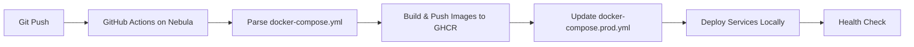

# Auto-deployment System Integration

## Overview
The auto-deployment system uses **self-hosted GitHub Runner** on Nebula, eliminating SSH secrets and simplifying deployment.

## Integration Points

### 1. **Self-hosted Runner Architecture**
- **Runner Location**: Directly on Nebula server
- **Access**: Local filesystem and Docker (no SSH required)
- **Repository**: hretheum/bezrobocie-detektor

### 2. **Service Discovery**
- **Source**: `docker-compose.yml` used as central service registry
- **Discovery**: GitHub Actions workflow parses `docker-compose.yml` to identify deployable services
- **Services**: 
  - `rtsp-capture`
  - `frame-tracking`
  - `base-template`
  - `echo-service`
  - `example-otel`
  - `gpu-demo`

### 3. **Workflow Integration**
- **File**: `.github/workflows/deploy.yml`
- **Runner**: `runs-on: self-hosted` (nebula)
- **Trigger**: Push to `main` branch with changes in:
  - `services/*/` directories
  - `docker-compose.yml`
  - `.github/workflows/deploy.yml`

### 4. **Deployment Process**


### 5. **Configuration Management**

#### **Docker Compose Integration**
- **Development**: `docker-compose.yml` (full stack)
- **Production**: `docker-compose.prod.yml` (deployed services only)
- **Auto-update**: Workflow automatically adds new services to production

#### **No SSH Secrets Required**
- **GitHub Token**: Auto-provided by GitHub Actions
- **Local Access**: Runner has direct Docker access
- **Filesystem**: Runner has access to `/opt/detektor`

### 6. **Service Registration Process**

#### **Adding New Service**
1. **Create service** in `services/[service-name]/`
2. **Add to docker-compose.yml**:
   ```yaml
   [service-name]:
     image: ghcr.io/hretheum/bezrobocie-detektor/[service-name]:latest
     ports:
       - "8xxx:8000"
     # ... other config
   ```
3. **Push to main** → Auto-deployment triggers on Nebula

#### **Service Requirements**
- **Dockerfile** in `services/[service-name]/Dockerfile`
- **Health endpoint** at `/health`
- **Environment variables**:
  - `SERVICE_NAME`
  - `OTEL_EXPORTER_OTLP_ENDPOINT`

### 7. **Current Status**

#### **RTSP Capture Service**
- **Status**: ✅ Ready for deployment
- **Image**: Available in GHCR
- **Workflow**: Configured for self-hosted runner
- **Next**: Push to main branch will trigger deployment

#### **Runner Status**
- **Location**: Nebula server (self-hosted)
- **Access**: Local Docker and filesystem
- **Repository**: Connected to hretheum/bezrobocie-detektor

### 8. **Setup Instructions**

#### **Initial Setup**
```bash
# 1. Verify runner is running
ssh nebula "ps aux | grep -i runner"

# 2. Push changes to main branch
git add .github/workflows/deploy.yml
git commit -m "feat: add self-hosted runner deployment"
git push origin main
```

#### **Manual Verification**
```bash
# Check running services
ssh nebula "docker ps --format 'table {{.Names}}\t{{.Image}}\t{{.Status}}'"

# Check specific service
ssh nebula "curl -f http://localhost:8001/health"
```

### 9. **Troubleshooting**

#### **Deployment Failed**
1. **Check logs**: GitHub Actions → Deploy workflow
2. **Check runner**: `systemctl status actions.runner.hretheum-bezrobocie-detektor.nebula`
3. **Check images**: `docker images | grep ghcr.io`

#### **Service Not Starting**
1. **Check configuration**: Verify service in docker-compose.prod.yml
2. **Check images**: Ensure image was pulled successfully
3. **Check ports**: Ensure no port conflicts

### 10. **Integration with Existing Documentation**

- **Quick Start**: See `docs/deployment/README.md`
- **Service-specific**: See `docs/deployment/services/[service-name].md`
- **Troubleshooting**: See `docs/deployment/troubleshooting/common-issues.md`

## Summary
The auto-deployment system uses **self-hosted GitHub Runner** on Nebula, eliminating SSH complexity. RTSP capture service is ready for deployment - **simply push to main branch to trigger automatic deployment**.