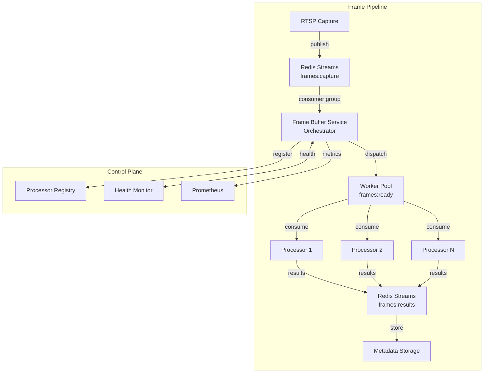

# Frame Buffer Service - Complete Redesign

## 1. Problem Analysis

### 1.1 Current Architecture Issues

#### Dead-End Problem
The current frame-buffer acts as a "dead-end" in the pipeline:
```
RTSP → Redis Stream → Frame Buffer Consumer → In-Memory Buffer → ❌ (nowhere)
                                                                    ↓
Sample Processor → /frames/dequeue API → ❌ (reads from different source)
```

**Root Cause**: The consumer stores frames in an in-memory buffer, but the API endpoints read directly from Redis, creating two disconnected data paths.

#### Shared State Problem
- `consumer.py` creates its own `FrameBuffer()` instance
- `main.py` API endpoints don't have access to this buffer
- The SharedFrameBuffer pattern was added as a band-aid but doesn't solve the fundamental issue

#### Concurrency Mismatch
- Consumer runs in a separate asyncio task
- Uses `threading.Lock` instead of `asyncio.Lock` in some places
- Mixing synchronous and asynchronous patterns causes confusion

#### Health Check Issues
- Health checks timeout frequently
- Redis Sentinel integration was attempted but disabled
- No proper monitoring of buffer state vs actual frame flow

#### Integration Complexity
- Processors need to poll the API continuously
- No push mechanism or event notification
- Inefficient polling leads to either high CPU usage or high latency

### 1.2 Performance Issues

1. **Double Buffering**: Frames are buffered twice (Redis Stream + in-memory)
2. **Polling Overhead**: Processors constantly poll even when no frames available
3. **Memory Pressure**: In-memory buffer can grow to 1000 frames with no backpressure to upstream
4. **Lost Frames**: When buffer fills, all new frames are dropped

### 1.3 Observability Gaps

1. **Broken Trace Chain**: Trace context is lost between buffer and processors
2. **Metrics Inconsistency**: Buffer metrics don't reflect actual frame flow
3. **No End-to-End Visibility**: Can't track a frame from capture to processing

## 2. Architecture Overview

### 2.1 Design Principles

1. **Single Source of Truth**: One queue, not multiple buffers
2. **Event-Driven**: Push frames to processors, don't make them poll
3. **Backpressure-Aware**: Slow consumers should slow down producers
4. **Cloud-Native**: Horizontally scalable, stateless where possible
5. **Observable**: Full tracing and metrics throughout

### 2.2 High-Level Design



### 2.3 Key Changes

1. **Frame Buffer as Orchestrator**: Not a buffer, but a smart dispatcher
2. **Direct Streaming**: Processors consume directly from Redis Streams
3. **Work Queue Pattern**: Separate stream for ready-to-process frames
4. **Registration System**: Processors register capabilities and capacity
5. **Smart Routing**: Route frames based on processor capabilities

## 3. Component Design

### 3.1 Frame Buffer Orchestrator

**Responsibilities:**
- Consume frames from capture stream
- Route frames to appropriate processors
- Monitor processor health and capacity
- Handle backpressure intelligently
- Maintain trace context throughout

**Key Features:**
- Stateless design (all state in Redis)
- Horizontal scaling support
- Circuit breaker for unhealthy processors
- Priority-based routing

**API Endpoints:**
```yaml
# Processor Management
POST   /processors/register     # Register a processor
DELETE /processors/{id}         # Unregister a processor
GET    /processors              # List all processors
GET    /processors/{id}/health  # Check processor health

# Frame Management
GET    /frames/stats           # Pipeline statistics
POST   /frames/route           # Manual frame routing (testing)
GET    /frames/backlogs        # Check frame backlogs

# Control Plane
POST   /control/pause          # Pause frame distribution
POST   /control/resume         # Resume frame distribution
GET    /control/status         # Get orchestrator status
```

### 3.2 Frame Distribution Algorithm

```python
class FrameDistributor:
    async def distribute_frame(self, frame: Frame) -> bool:
        # 1. Check if distribution is paused
        if self.is_paused():
            return False

        # 2. Get eligible processors
        processors = await self.get_healthy_processors()
        if not processors:
            # No healthy processors, apply backpressure
            return False

        # 3. Filter by capabilities
        capable_processors = [
            p for p in processors
            if p.can_process(frame.type)
        ]

        # 4. Select processor based on load
        processor = self.select_processor(capable_processors, frame)

        # 5. Dispatch to processor's queue
        await self.dispatch_to_processor(processor, frame)

        # 6. Update metrics
        self.metrics.frames_distributed.inc()

        return True

    def select_processor(self, processors: List[Processor], frame: Frame) -> Processor:
        # Implement various strategies:
        # - Least loaded
        # - Round robin
        # - Affinity-based (same camera to same processor)
        # - Priority-based
        return min(processors, key=lambda p: p.current_load)
```

### 3.3 Processor Client Library

```python
class ProcessorClient:
    def __init__(self, processor_id: str, capabilities: List[str]):
        self.id = processor_id
        self.capabilities = capabilities
        self.orchestrator_url = os.getenv("ORCHESTRATOR_URL")
        self.queue_name = f"frames:ready:{processor_id}"

    async def start(self):
        # 1. Register with orchestrator
        await self.register()

        # 2. Start health reporting
        asyncio.create_task(self.health_reporter())

        # 3. Start consuming frames
        await self.consume_frames()

    async def register(self):
        await self.http_client.post(
            f"{self.orchestrator_url}/processors/register",
            json={
                "id": self.id,
                "capabilities": self.capabilities,
                "capacity": self.max_concurrent_frames,
                "queue": self.queue_name
            }
        )

    async def consume_frames(self):
        async for frame in self.redis_stream_consumer(self.queue_name):
            # Process with trace context
            with TraceContext.extract_from_carrier(frame) as ctx:
                ctx.add_event(f"processor_{self.id}_received")
                result = await self.process_frame(frame)
                await self.publish_result(result)
```

### 3.4 Backpressure Mechanism

```python
class BackpressureController:
    def __init__(self):
        self.thresholds = {
            "low": 0.6,    # 60% capacity
            "high": 0.8,   # 80% capacity
            "critical": 0.95  # 95% capacity
        }

    async def check_pressure(self) -> PressureLevel:
        # Check all processor queues
        queue_sizes = await self.get_queue_sizes()
        max_utilization = max(
            size / capacity
            for size, capacity in queue_sizes.items()
        )

        if max_utilization > self.thresholds["critical"]:
            return PressureLevel.CRITICAL
        elif max_utilization > self.thresholds["high"]:
            return PressureLevel.HIGH
        elif max_utilization > self.thresholds["low"]:
            return PressureLevel.MODERATE
        else:
            return PressureLevel.NORMAL

    async def apply_backpressure(self, level: PressureLevel):
        if level == PressureLevel.CRITICAL:
            # Pause upstream consumption
            await self.pause_consumption()
            await self.alert_operators("Critical backpressure detected")
        elif level == PressureLevel.HIGH:
            # Slow down consumption
            await self.set_consumption_rate(0.5)  # 50% rate
        elif level == PressureLevel.MODERATE:
            # Minor slowdown
            await self.set_consumption_rate(0.8)  # 80% rate
        else:
            # Normal operation
            await self.set_consumption_rate(1.0)  # 100% rate
```

## 4. API Design

### 4.1 REST API Specification

```yaml
openapi: 3.0.0
info:
  title: Frame Buffer Orchestrator API
  version: 2.0.0

paths:
  /processors/register:
    post:
      summary: Register a processor
      requestBody:
        content:
          application/json:
            schema:
              type: object
              required: [id, capabilities, capacity, queue]
              properties:
                id:
                  type: string
                  example: "face-detector-1"
                capabilities:
                  type: array
                  items:
                    type: string
                  example: ["face_detection", "person_detection"]
                capacity:
                  type: integer
                  example: 100
                queue:
                  type: string
                  example: "frames:ready:face-detector-1"
      responses:
        201:
          description: Processor registered
        409:
          description: Processor already registered

  /frames/stats:
    get:
      summary: Get pipeline statistics
      responses:
        200:
          description: Pipeline statistics
          content:
            application/json:
              schema:
                type: object
                properties:
                  frames_per_second:
                    type: number
                  active_processors:
                    type: integer
                  queue_depths:
                    type: object
                  backpressure_level:
                    type: string
                    enum: [normal, moderate, high, critical]
```

### 4.2 Event Schemas

```python
@dataclass
class FrameReadyEvent:
    """Event published when frame is ready for processing."""
    frame_id: str
    camera_id: str
    timestamp: datetime
    size_bytes: int
    width: int
    height: int
    format: str
    trace_context: Dict[str, str]
    priority: int = 0
    metadata: Dict[str, Any] = field(default_factory=dict)

@dataclass
class ProcessorHealthEvent:
    """Event published by processors for health reporting."""
    processor_id: str
    timestamp: datetime
    status: str  # healthy, degraded, unhealthy
    capacity_used: float  # 0.0 to 1.0
    frames_processed: int
    avg_processing_time_ms: float
    errors_last_minute: int
```

## 5. Data Flow

### 5.1 Frame Lifecycle

```
1. CAPTURE
   - RTSP service captures frame
   - Generates FrameID and TraceContext
   - Publishes to frames:capture stream

2. ORCHESTRATION
   - Frame Buffer consumes from frames:capture
   - Evaluates processor availability
   - Routes to appropriate processor queue
   - Updates trace with routing decision

3. PROCESSING
   - Processor consumes from its queue
   - Processes frame with trace context
   - Publishes results to frames:results

4. STORAGE
   - Metadata service consumes results
   - Stores in TimescaleDB
   - Indexes by frame_id and trace_id
```

### 5.2 Backpressure Flow

```
1. DETECTION
   - Monitor all processor queue depths
   - Calculate utilization percentages
   - Determine pressure level

2. RESPONSE
   - Normal: Full speed consumption
   - Moderate: Reduce consumption rate
   - High: Significant slowdown + alerts
   - Critical: Pause consumption + escalate

3. RECOVERY
   - Monitor queue drainage
   - Gradually increase consumption
   - Return to normal when safe
```

## 6. Error Handling & Recovery

### 6.1 Failure Modes

1. **Processor Failure**
   - Detected via health checks
   - Frames rerouted to healthy processors
   - Failed processor queues monitored

2. **Orchestrator Failure**
   - Multiple orchestrator instances for HA
   - Redis Streams provide durability
   - Processors continue consuming existing queues

3. **Network Partition**
   - Redis Sentinel for automatic failover
   - Consumer groups ensure no message loss
   - Automatic reconnection with exponential backoff

### 6.2 Recovery Strategies

```python
class RecoveryManager:
    async def handle_processor_failure(self, processor_id: str):
        # 1. Mark processor as unhealthy
        await self.mark_unhealthy(processor_id)

        # 2. Stop routing new frames
        await self.stop_routing_to(processor_id)

        # 3. Check unprocessed frames
        unprocessed = await self.get_queue_size(processor_id)

        if unprocessed > 0:
            # 4. Redistribute frames
            await self.redistribute_frames(processor_id)

        # 5. Alert operators
        await self.send_alert(f"Processor {processor_id} failed, {unprocessed} frames redistributed")

    async def handle_orchestrator_failure(self):
        # Handled by Kubernetes/Docker Swarm
        # - Health checks detect failure
        # - New instance started automatically
        # - Redis consumer groups preserve state
        pass
```

## 7. Monitoring & Health Checks

### 7.1 Health Check Endpoints

```python
@app.get("/health")
async def health_check():
    checks = {
        "redis": await check_redis_connection(),
        "processors": await check_processor_health(),
        "backpressure": await check_backpressure(),
        "consumption_rate": await get_consumption_rate()
    }

    status = "healthy"
    if not all(checks.values()):
        status = "unhealthy"
    elif await get_backpressure_level() == "high":
        status = "degraded"

    return {
        "status": status,
        "checks": checks,
        "metrics": {
            "frames_per_second": await get_fps(),
            "active_processors": await count_active_processors(),
            "queue_depth": await get_total_queue_depth()
        }
    }
```

### 7.2 Prometheus Metrics

```python
# Orchestrator metrics
frames_routed_total = Counter(
    "frame_buffer_frames_routed_total",
    "Total frames routed to processors",
    ["processor_id", "camera_id"]
)

routing_duration_seconds = Histogram(
    "frame_buffer_routing_duration_seconds",
    "Time to route frame to processor"
)

backpressure_level = Gauge(
    "frame_buffer_backpressure_level",
    "Current backpressure level (0=normal, 3=critical)"
)

processor_queue_depth = Gauge(
    "frame_buffer_processor_queue_depth",
    "Current queue depth per processor",
    ["processor_id"]
)

# Processor metrics
frames_processed_total = Counter(
    "processor_frames_processed_total",
    "Total frames processed",
    ["processor_id", "result"]
)

processing_duration_seconds = Histogram(
    "processor_processing_duration_seconds",
    "Frame processing duration",
    ["processor_id", "operation"]
)
```

### 7.3 Distributed Tracing

```python
class TraceContextPropagation:
    @staticmethod
    async def propagate_through_orchestrator(frame_data: dict) -> dict:
        # Extract existing context
        with TraceContext.extract_from_carrier(frame_data) as ctx:
            # Add orchestrator span
            ctx.add_event("frame_buffer_orchestrator_received")
            ctx.set_attribute("orchestrator.version", "2.0")

            # Routing decision span
            with ctx.start_span("route_frame") as span:
                processor = await select_processor(frame_data)
                span.set_attribute("selected_processor", processor.id)
                span.set_attribute("processor_load", processor.current_load)

            # Inject updated context
            ctx.inject_to_carrier(frame_data)

        return frame_data
```

## 8. Integration Guide

### 8.1 Migrating Existing Processors

```python
# Old way (polling)
class OldProcessor:
    async def consume_loop(self):
        while True:
            response = await http_client.get(
                "http://frame-buffer:8002/frames/dequeue"
            )
            if response.status == 200:
                frames = await response.json()
                for frame in frames["frames"]:
                    await self.process(frame)
            await asyncio.sleep(0.1)

# New way (event-driven)
class NewProcessor(ProcessorClient):
    def __init__(self):
        super().__init__(
            processor_id="my-processor-1",
            capabilities=["object_detection", "face_detection"]
        )

    async def process_frame(self, frame_data: dict) -> dict:
        # Your processing logic here
        result = await self.detect_objects(frame_data)
        return {
            "frame_id": frame_data["frame_id"],
            "detections": result,
            "processor_id": self.id
        }
```

### 8.2 Configuration

```yaml
# docker-compose.yml
services:
  frame-buffer:
    image: ghcr.io/hretheum/detektr/frame-buffer:2.0
    environment:
      - REDIS_URL=redis://redis:6379
      - MAX_PROCESSORS=50
      - ORCHESTRATOR_MODE=distributed
      - HEALTH_CHECK_INTERVAL=10
      - BACKPRESSURE_CHECK_INTERVAL=5
    depends_on:
      - redis

  face-detector:
    image: ghcr.io/hretheum/detektr/face-detector:latest
    environment:
      - ORCHESTRATOR_URL=http://frame-buffer:8002
      - PROCESSOR_ID=face-detector-1
      - PROCESSOR_CAPABILITIES=face_detection,person_detection
      - MAX_CONCURRENT_FRAMES=20
    depends_on:
      - frame-buffer
```

### 8.3 Client Library Usage

```python
# Install client library
# pip install detektor-processor-client

from detektor.processor import ProcessorClient, ProcessorConfig

class MyProcessor(ProcessorClient):
    def __init__(self):
        config = ProcessorConfig(
            processor_id="my-processor",
            capabilities=["object_detection"],
            max_concurrent_frames=10,
            orchestrator_url="http://frame-buffer:8002"
        )
        super().__init__(config)

    async def process_frame(self, frame_data: dict) -> dict:
        # Process frame
        detections = await self.run_detection(frame_data)

        return {
            "frame_id": frame_data["frame_id"],
            "detections": detections,
            "processing_time_ms": 42.5
        }

# Run processor
if __name__ == "__main__":
    processor = MyProcessor()
    asyncio.run(processor.start())
```

## 9. Implementation Roadmap

### Phase 1: Core Orchestrator (Week 1)
- [ ] Implement basic orchestrator with processor registry
- [ ] Create processor registration API
- [ ] Implement health monitoring
- [ ] Basic routing algorithm (round-robin)

### Phase 2: Event-Driven Pipeline (Week 2)
- [ ] Migrate from polling to Redis Streams consumer groups
- [ ] Implement processor client library
- [ ] Add trace context propagation
- [ ] Convert sample-processor to new model

### Phase 3: Advanced Features (Week 3)
- [ ] Implement backpressure controller
- [ ] Add smart routing algorithms
- [ ] Implement circuit breakers
- [ ] Add processor affinity support

### Phase 4: Production Hardening (Week 4)
- [ ] Add comprehensive metrics
- [ ] Implement distributed tracing
- [ ] Add integration tests
- [ ] Performance benchmarking
- [ ] Documentation and migration guide

### Phase 5: Migration (Week 5)
- [ ] Deploy new frame-buffer alongside old one
- [ ] Migrate processors one by one
- [ ] Monitor both systems in parallel
- [ ] Gradual traffic shift
- [ ] Decommission old frame-buffer

## Success Criteria

1. **Performance**
   - Handle 100+ fps sustained load
   - <10ms routing decision latency
   - <100ms end-to-end frame processing

2. **Reliability**
   - Zero frame loss under normal operation
   - Graceful degradation under overload
   - Automatic recovery from failures

3. **Scalability**
   - Support 50+ concurrent processors
   - Horizontal scaling of orchestrators
   - Linear performance scaling

4. **Observability**
   - Complete trace for every frame
   - Real-time metrics and dashboards
   - Proactive alerting on issues

## Conclusion

This redesign transforms the frame-buffer from a problematic bottleneck into a intelligent orchestration layer that:

1. **Eliminates the dead-end problem** by using event-driven streaming
2. **Provides proper backpressure** to prevent frame loss
3. **Scales horizontally** for high-throughput scenarios
4. **Maintains trace context** for full observability
5. **Simplifies processor integration** with a clean client library

The new architecture is cloud-native, follows microservice best practices, and provides a solid foundation for the entire frame processing pipeline.
