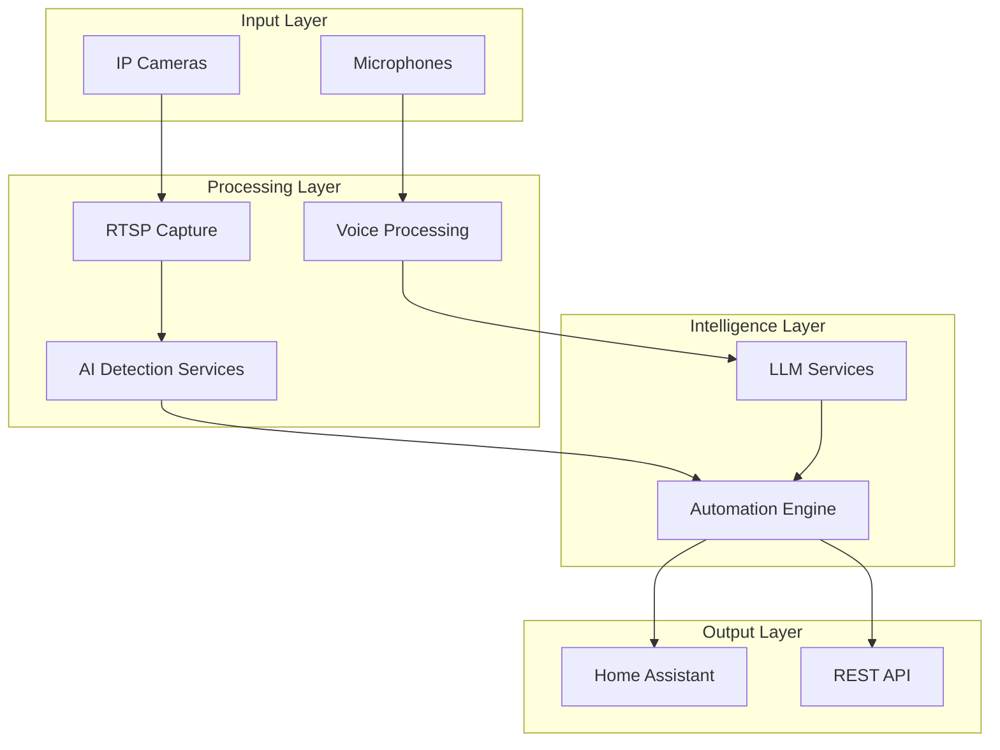

# Detektor - Visual Detection & Automation System

Welcome to the Detektor documentation. Detektor is an advanced visual detection and home automation system that uses AI to analyze camera feeds and trigger intelligent actions in your smart home.

## What is Detektor?

Detektor is a comprehensive system that:

- **Captures** video streams from IP cameras
- **Detects** objects, faces, and gestures using AI models
- **Recognizes** voice commands and processes natural language
- **Automates** home devices through Home Assistant integration
- **Learns** from user interactions to improve over time

## Key Features

### 🎥 **Multi-Camera Support**

Process up to 8 IP camera streams simultaneously with real-time analysis.

### 🤖 **AI-Powered Detection**

- Object detection (YOLO)
- Face recognition (InsightFace)
- Gesture recognition (MediaPipe)
- Voice processing (Whisper)

### 🏠 **Home Assistant Integration**

Seamless integration with Home Assistant for device control and automation.

### 🧠 **LLM Intelligence**

Natural language processing with OpenAI/Anthropic for smart intent recognition.

### 📊 **Full Observability**

Complete monitoring with Prometheus, Grafana, and Jaeger tracing from day one.

### 🔒 **Security First**

Privacy-focused design with end-to-end encryption and local processing.

## Quick Start

1. **[Set up your development environment](development/getting-started.md)**
2. **[Review the system architecture](architecture/overview.md)**
3. **[Install the system](operations/installation.md)**
4. **[Configure your cameras and automation](operations/configuration.md)**

## System Architecture

## Project Phases

The Detektor project is organized into 6 development phases:

| Phase | Focus | Duration | Status |
|-------|-------|----------|--------|
| [**Phase 0**](faza-0-dokumentacja/) | Documentation & Planning | 2 weeks | ✅ Complete |
| [**Phase 1**](faza-1-fundament/) | Foundation & Observability | 3 weeks | ✅ Complete |
| [**Phase 2**](faza-2-akwizycja/) | Video Acquisition | 2 weeks | ⏳ Planned |
| [**Phase 3**](faza-3-detekcja/) | AI Detection Services | 4 weeks | ⏳ Planned |
| [**Phase 4**](faza-4-integracja/) | Integration & Automation | 3 weeks | ⏳ Planned |
| [**Phase 5**](faza-5-llm/) | LLM & Voice Processing | 2 weeks | ⏳ Planned |
| [**Phase 6**](faza-6-optymalizacja/) | Optimization & Production | 1 week | ⏳ Planned |

## Documentation Sections

### For Users

- **[Quick Start](quickstart.md)** - Get up and running quickly
- **[Installation Guide](operations/installation.md)** - Complete setup instructions
- **[Configuration](operations/configuration.md)** - System configuration
- **[API Reference](api/overview.md)** - Complete API documentation

### For Developers

- **[Development Guide](development/getting-started.md)** - Set up development environment
- **[Contributing](CONTRIBUTING.md)** - How to contribute to the project
- **[Architecture](architecture/overview.md)** - System design and architecture
- **[Style Guide](style-guide.md)** - Documentation standards

### For Operators

- **[Monitoring](operations/monitoring.md)** - Observability and monitoring
- **[Troubleshooting](operations/troubleshooting.md)** - Common issues and solutions
- **[Runbooks](operations/)** - Operational procedures

## Getting Help

- **GitHub Issues**: [Report bugs or request features](https://github.com/hretheum/detektr/issues)
- **Discussions**: [Community discussions](https://github.com/hretheum/detektr/discussions)
- **Documentation**: Browse this documentation for detailed information

## License

This project is open source and available under the [MIT License](https://github.com/hretheum/detektr/blob/main/LICENSE).

---

Ready to get started? Check out our [Quick Start Guide](quickstart.md) or dive into the [Architecture Overview](architecture/overview.md).
