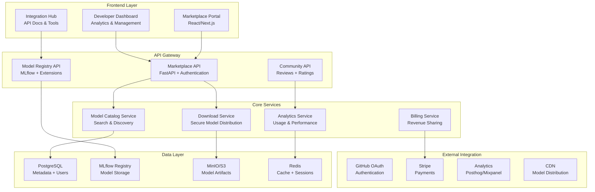

# Zadanie SL-5.1: AI Agent Marketplace & Community Platform

<!--
LLM PROMPT dla tego zadania:
Implementacja platformy marketplace'u dla udostępniania i wymiany AI agentów oraz ich modeli.
Cel: Stworzenie ecosystem gdzie różne projekty mogą dzielić się wzorcami uczenia i modelami.

KLUCZOWE ZAŁOŻENIA:
- Open Source first approach
- Security-first dla shared models
- API-driven architecture dla łatwej integracji
- Support dla różnych technologii (nie tylko Python)
- Monetization model opcjonalny (freemium)

ZALEŻNOŚCI:
- Zakończona Faza SL-4 (wszyscy agenci z ML)
- MLflow registry operational
- Feature store stabilny
- Security framework ready

DELIVERABLES:
- Marketplace API platform
- Community portal frontend
- Model sharing protocols
- Revenue sharing mechanism
- Developer ecosystem tools
-->

## 📋 Spis Treści
1. [Cel i Scope](#cel-i-scope)
2. [Architektura Marketplace](#architektura-marketplace)
3. [Model Biznesowy](#model-biznesowy)
4. [Zadania Atomowe](#zadania-atomowe)
5. [Technical Implementation](#technical-implementation)
6. [Security & Governance](#security--governance)
7. [Community Features](#community-features)
8. [Monetization Strategy](#monetization-strategy)
9. [API Specification](#api-specification)
10. [Success Metrics](#success-metrics)

## Cel i Scope

### Główny Cel
Stworzenie platformy marketplace'u umożliwiającej:
- **Sharing**: Udostępnianie trained models i learning patterns
- **Discovery**: Znajdowanie i porównywanie dostępnych agentów
- **Integration**: Łatwa integracja z istniejącymi projektami
- **Monetization**: Opcjonalne modele revenue sharing
- **Community**: Tools dla współpracy i feedback

### Business Value
```python
marketplace_value_proposition = {
    "for_contributors": {
        "revenue_sharing": "70% commission for premium models",
        "reputation_building": "Public profile + achievement system",
        "feedback_loop": "Real usage metrics + user feedback",
        "collaboration": "Cross-project knowledge sharing"
    },
    "for_users": {
        "accelerated_development": "Pre-trained models vs training from scratch",
        "quality_assurance": "Community-validated models",
        "cost_reduction": "Avoid duplicate ML development effort",
        "best_practices": "Access to proven patterns"
    },
    "for_ecosystem": {
        "innovation_acceleration": "Faster adoption of AI in development",
        "standard_emergence": "Common patterns and interfaces",
        "community_growth": "Network effects and collaboration",
        "knowledge_preservation": "Capture and share learnings"
    }
}
```

### Scope Definition
**In Scope:**
- Model sharing (trained ML models)
- Pattern sharing (learning algorithms)
- Agent templates (boilerplate code)
- Integration tools (APIs, SDKs)
- Community features (ratings, reviews, discussion)
- Basic monetization (freemium + premium)

**Out of Scope:**
- Full IDE/development environment
- Code hosting (use GitHub integration)
- Complex payment processing (use Stripe)
- Enterprise support (future phase)

## Architektura Marketplace

### High-Level Architecture



### Service Architecture

```python
# Microservices breakdown
marketplace_services = {
    "marketplace-api": {
        "responsibility": "Main API gateway, authentication, authorization",
        "tech_stack": "FastAPI, SQLAlchemy, Alembic",
        "port": 8200,
        "endpoints": ["/auth", "/models", "/users", "/billing"]
    },
    "model-catalog": {
        "responsibility": "Model search, discovery, metadata management",
        "tech_stack": "FastAPI, Elasticsearch, PostgreSQL",
        "port": 8201,
        "endpoints": ["/search", "/categories", "/recommendations"]
    },
    "download-service": {
        "responsibility": "Secure model download, license validation",
        "tech_stack": "FastAPI, MinIO, Redis",
        "port": 8202,
        "endpoints": ["/download", "/validate", "/metrics"]
    },
    "community-service": {
        "responsibility": "Reviews, ratings, discussions, support",
        "tech_stack": "FastAPI, PostgreSQL, WebSocket",
        "port": 8203,
        "endpoints": ["/reviews", "/ratings", "/discussions", "/support"]
    },
    "analytics-service": {
        "responsibility": "Usage analytics, performance metrics, reporting",
        "tech_stack": "FastAPI, ClickHouse, TimescaleDB",
        "port": 8204,
        "endpoints": ["/metrics", "/reports", "/insights"]
    },
    "billing-service": {
        "responsibility": "Revenue sharing, payments, subscription management",
        "tech_stack": "FastAPI, Stripe, PostgreSQL",
        "port": 8205,
        "endpoints": ["/billing", "/payments", "/revenue"]
    }
}
```

## Model Biznesowy

### Revenue Streams

```python
revenue_model = {
    "freemium_tier": {
        "free_features": [
            "Basic model download (public models)",
            "Community features (reviews, ratings)",
            "Basic analytics (download counts)",
            "GitHub integration",
            "Up to 10 model downloads/month"
        ],
        "revenue": 0,
        "target_users": "Individual developers, open source projects"
    },
    "pro_tier": {
        "monthly_fee": 29,  # USD
        "features": [
            "Unlimited model downloads",
            "Premium model access",
            "Advanced analytics",
            "Priority support",
            "Team collaboration tools",
            "API access (higher rate limits)"
        ],
        "target_users": "Professional developers, small teams"
    },
    "enterprise_tier": {
        "monthly_fee": 199,  # USD
        "features": [
            "Everything in Pro",
            "Private model hosting",
            "Custom integrations",
            "SLA guarantees",
            "Dedicated support",
            "On-premise deployment options"
        ],
        "target_users": "Large companies, enterprise teams"
    },
    "marketplace_commission": {
        "free_models": "0% commission",
        "paid_models": "30% commission (contributor keeps 70%)",
        "subscription_models": "30% of recurring revenue",
        "support_services": "20% commission"
    }
}

# Revenue projections (Year 1)
projected_revenue = {
    "month_1_6": {
        "free_users": 100,
        "pro_users": 5,
        "enterprise_users": 0,
        "monthly_revenue": 145,  # 5 * $29
        "marketplace_commission": 50  # Early paid models
    },
    "month_7_12": {
        "free_users": 500,
        "pro_users": 25,
        "enterprise_users": 2,
        "monthly_revenue": 1123,  # 25*29 + 2*199
        "marketplace_commission": 300
    },
    "year_1_total": 9000,  # Conservative estimate
    "year_2_projection": 45000,  # 5x growth with network effects
    "break_even_month": 8  # When revenue > costs
}
```

### Value Proposition Canvas

```python
value_propositions = {
    "for_model_creators": {
        "jobs_to_be_done": [
            "Monetize ML expertise and time investment",
            "Build reputation in AI community",
            "Get feedback on model quality",
            "Reach wider audience for models"
        ],
        "pain_points": [
            "Lack of distribution channels for ML models",
            "Difficulty monetizing AI research",
            "No feedback on model performance",
            "Limited visibility in AI community"
        ],
        "gain_creators": [
            "Revenue sharing from model downloads",
            "Public profile with achievements",
            "Usage analytics and feedback",
            "Marketing and promotion support"
        ]
    },
    "for_model_consumers": {
        "jobs_to_be_done": [
            "Find high-quality pre-trained models",
            "Reduce AI development time and cost",
            "Learn best practices from experts",
            "Integrate AI capabilities quickly"
        ],
        "pain_points": [
            "Training models from scratch is expensive",
            "Hard to find quality models",
            "Uncertainty about model performance",
            "Complex integration processes"
        ],
        "gain_creators": [
            "Curated selection of validated models",
            "Easy integration tools and documentation",
            "Performance metrics and reviews",
            "Cost savings vs custom development"
        ]
    }
}
```

## Zadania Atomowe

### Blok 0: Prerequisites i Planning (1 tydzień)

#### Zadanie 0.1: Market Research & Competition Analysis (4h)
```yaml
description: "Analiza konkurencji i identyfikacja unique value proposition"
actions:
  - Research existing AI marketplaces (Hugging Face Hub, Algorithmia, etc.)
  - Analyze pricing models and features
  - Identify gaps and opportunities
  - Document competitive advantages
deliverables:
  - Competition analysis report
  - Market positioning strategy
  - Unique value proposition definition
success_criteria:
  - Clear differentiation strategy defined
  - Pricing model validated against competition
  - Target market segments identified
```

#### Zadanie 0.2: Technical Architecture Planning (6h)
```yaml
description: "Detailed technical architecture i infrastructure planning"
actions:
  - Design microservices architecture
  - Plan database schemas
  - Define API specifications
  - Security and compliance planning
deliverables:
  - Technical architecture document
  - API specification (OpenAPI)
  - Database schema design
  - Security framework plan
success_criteria:
  - Architecture supports expected scale (1000+ models, 10k+ users)
  - Security compliant with SOC2 requirements
  - API design follows RESTful best practices
```

#### Zadanie 0.3: Legal & Compliance Framework (4h)
```yaml
description: "Legal framework dla model sharing i revenue"
actions:
  - Model licensing framework design
  - Terms of service and privacy policy
  - Revenue sharing agreements
  - GDPR compliance planning
deliverables:
  - Legal framework documentation
  - Terms of service
  - Privacy policy
  - Model licensing templates
success_criteria:
  - GDPR compliant data handling
  - Clear licensing terms for models
  - Revenue sharing legally structured
```

### Blok 1: Core Platform Infrastructure (2 tygodnie)

#### Zadanie 1.1: Marketplace API Development (16h)
```yaml
description: "Core API dla marketplace funkcjonalności"
actions:
  - FastAPI setup with authentication
  - User management and profiles
  - Model catalog CRUD operations
  - Search and discovery endpoints
deliverables:
  - marketplace-api service
  - User authentication system
  - Model catalog API
  - API documentation
success_criteria:
  - API responds <100ms for 95% requests
  - Authentication working with GitHub OAuth
  - Full CRUD operations for models
  - Comprehensive API documentation
```

#### Zadanie 1.2: Model Registry Integration (12h)
```yaml
description: "Integration z MLflow dla model storage i versioning"
actions:
  - Extend MLflow for marketplace features
  - Model upload and validation
  - Version management
  - Metadata enrichment
deliverables:
  - Extended MLflow configuration
  - Model upload service
  - Validation pipeline
  - Metadata management
success_criteria:
  - Models uploaded successfully via API
  - Automatic validation and metadata extraction
  - Version control working properly
  - Integration with existing MLflow setup
```

#### Zadanie 1.3: Database Schema Implementation (8h)
```yaml
description: "Database schema dla marketplace data"
actions:
  - PostgreSQL schema design
  - User and model tables
  - Reviews and ratings schema
  - Analytics tracking tables
deliverables:
  - Database migration scripts
  - Data models (SQLAlchemy)
  - Seed data for testing
  - Database documentation
success_criteria:
  - Schema supports all planned features
  - Proper indexing for performance
  - Foreign key constraints enforced
  - Migration scripts tested
```

### Blok 2: Frontend Development (2 tygodnie)

#### Zadanie 2.1: Marketplace Portal Frontend (20h)
```yaml
description: "User-facing marketplace portal"
actions:
  - React/Next.js setup
  - Model browsing and search UI
  - User profiles and dashboards
  - Responsive design implementation
deliverables:
  - Marketplace frontend application
  - Model discovery interface
  - User dashboard
  - Mobile-responsive design
success_criteria:
  - Fast loading (<2s initial load)
  - Intuitive model discovery flow
  - Responsive on mobile devices
  - Accessible (WCAG 2.1 AA compliant)
```

#### Zadanie 2.2: Developer Dashboard (16h)
```yaml
description: "Dashboard dla model creators i analytics"
actions:
  - Model management interface
  - Analytics and metrics visualization
  - Revenue tracking dashboard
  - Upload and publishing flow
deliverables:
  - Developer dashboard app
  - Analytics visualization
  - Model management tools
  - Publishing workflow
success_criteria:
  - Complete model lifecycle management
  - Real-time analytics updates
  - Intuitive publishing process
  - Revenue tracking accurate
```

#### Zadanie 2.3: Integration Documentation Site (12h)
```yaml
description: "Documentation i tools dla developers"
actions:
  - API documentation site
  - SDK and integration guides
  - Code examples and tutorials
  - Interactive API explorer
deliverables:
  - Documentation website
  - Integration guides
  - Code examples
  - API explorer tool
success_criteria:
  - Complete API documentation
  - Working code examples
  - Easy-to-follow integration guides
  - Interactive testing capabilities
```

### Blok 3: Advanced Features (2 tygodnie)

#### Zadanie 3.1: Community Features Implementation (14h)
```yaml
description: "Reviews, ratings, discussions dla models"
actions:
  - Review and rating system
  - Discussion threads
  - Model recommendations
  - User reputation system
deliverables:
  - Community features API
  - Review and rating UI
  - Discussion system
  - Recommendation engine
success_criteria:
  - Users can rate and review models
  - Discussion threads working
  - Recommendations improve discovery
  - Reputation system incentivizes quality
```

#### Zadanie 3.2: Advanced Search & Discovery (12h)
```yaml
description: "Enhanced search z ML-powered recommendations"
actions:
  - Elasticsearch integration
  - ML-powered recommendations
  - Semantic search capabilities
  - Advanced filtering options
deliverables:
  - Enhanced search service
  - Recommendation algorithm
  - Semantic search features
  - Advanced filters
success_criteria:
  - Sub-second search responses
  - Relevant recommendations
  - Semantic search working
  - Comprehensive filtering options
```

#### Zadanie 3.3: Analytics & Insights Platform (10h)
```yaml
description: "Advanced analytics dla model performance i usage"
actions:
  - Usage analytics collection
  - Performance metrics tracking
  - Business intelligence dashboard
  - Automated reporting
deliverables:
  - Analytics service
  - BI dashboard
  - Automated reports
  - Performance monitoring
success_criteria:
  - Real-time usage tracking
  - Comprehensive performance metrics
  - Automated weekly reports
  - Business insights dashboard
```

### Blok 4: Monetization & Billing (1 tydzień)

#### Zadanie 4.1: Billing System Implementation (12h)
```yaml
description: "Payment processing i subscription management"
actions:
  - Stripe integration
  - Subscription management
  - Revenue sharing calculations
  - Payment processing
deliverables:
  - Billing service
  - Stripe integration
  - Subscription management
  - Revenue sharing system
success_criteria:
  - Payments processed successfully
  - Subscriptions managed automatically
  - Revenue sharing calculated correctly
  - PCI compliance maintained
```

#### Zadanie 4.2: Revenue Sharing System (8h)
```yaml
description: "System do revenue sharing z model creators"
actions:
  - Revenue calculation engine
  - Payout processing
  - Tax handling considerations
  - Financial reporting
deliverables:
  - Revenue sharing engine
  - Payout system
  - Financial reports
  - Tax documentation
success_criteria:
  - Accurate revenue calculations
  - Automated payout processing
  - Financial reporting accurate
  - Tax compliance considered
```

### Blok 5: Security & Production Readiness (1 tydzień)

#### Zadanie 5.1: Security Hardening (10h)
```yaml
description: "Security measures dla production deployment"
actions:
  - Security audit and hardening
  - API rate limiting
  - Input validation
  - Security monitoring
deliverables:
  - Security audit report
  - Hardened services
  - Rate limiting configuration
  - Security monitoring
success_criteria:
  - Security audit passes
  - APIs protected against common attacks
  - Rate limiting prevents abuse
  - Security monitoring operational
```

#### Zadanie 5.2: Production Deployment (8h)
```yaml
description: "Production deployment i monitoring setup"
actions:
  - Production environment setup
  - CI/CD pipeline configuration
  - Monitoring and alerting
  - Backup and disaster recovery
deliverables:
  - Production environment
  - CI/CD pipeline
  - Monitoring setup
  - Backup procedures
success_criteria:
  - Production environment stable
  - Automated deployments working
  - Comprehensive monitoring
  - Disaster recovery tested
```

### Blok 6: Launch & Community Building (1 tydzień)

#### Zadanie 6.1: Beta Launch (8h)
```yaml
description: "Beta launch z limited audience"
actions:
  - Beta user recruitment
  - Launch preparation
  - Initial content seeding
  - Feedback collection
deliverables:
  - Beta launch
  - Initial user base
  - Seeded content
  - Feedback system
success_criteria:
  - 50+ beta users registered
  - 10+ models published
  - Positive user feedback
  - No critical issues
```

#### Zadanie 6.2: Marketing & Community Outreach (6h)
```yaml
description: "Marketing materials i community building"
actions:
  - Landing page optimization
  - Content marketing strategy
  - Social media presence
  - Developer community outreach
deliverables:
  - Marketing materials
  - Content strategy
  - Social media presence
  - Community outreach plan
success_criteria:
  - Professional marketing materials
  - Active social media presence
  - Developer community engagement
  - Growing user base
```

## Technical Implementation

### API Specification

```yaml
openapi: 3.0.0
info:
  title: AI Agent Marketplace API
  version: 1.0.0
  description: API for AI agent and model sharing platform

paths:
  /auth/login:
    post:
      summary: User authentication via GitHub OAuth
      requestBody:
        required: true
        content:
          application/json:
            schema:
              type: object
              properties:
                github_token:
                  type: string
                redirect_uri:
                  type: string
      responses:
        200:
          description: Authentication successful
          content:
            application/json:
              schema:
                type: object
                properties:
                  access_token:
                    type: string
                  refresh_token:
                    type: string
                  user:
                    $ref: '#/components/schemas/User'

  /models:
    get:
      summary: Search and browse models
      parameters:
        - name: q
          in: query
          schema:
            type: string
        - name: category
          in: query
          schema:
            type: string
        - name: agent_type
          in: query
          schema:
            type: string
        - name: page
          in: query
          schema:
            type: integer
        - name: limit
          in: query
          schema:
            type: integer
      responses:
        200:
          description: List of models
          content:
            application/json:
              schema:
                type: object
                properties:
                  models:
                    type: array
                    items:
                      $ref: '#/components/schemas/Model'
                  total:
                    type: integer
                  page:
                    type: integer
                  limit:
                    type: integer

    post:
      summary: Upload a new model
      security:
        - ApiKeyAuth: []
      requestBody:
        required: true
        content:
          multipart/form-data:
            schema:
              type: object
              properties:
                model_file:
                  type: string
                  format: binary
                metadata:
                  $ref: '#/components/schemas/ModelMetadata'
      responses:
        201:
          description: Model uploaded successfully
          content:
            application/json:
              schema:
                $ref: '#/components/schemas/Model'

  /models/{model_id}:
    get:
      summary: Get model details
      parameters:
        - name: model_id
          in: path
          required: true
          schema:
            type: string
      responses:
        200:
          description: Model details
          content:
            application/json:
              schema:
                $ref: '#/components/schemas/ModelDetails'

  /models/{model_id}/download:
    post:
      summary: Download model (with license validation)
      security:
        - ApiKeyAuth: []
      parameters:
        - name: model_id
          in: path
          required: true
          schema:
            type: string
      responses:
        200:
          description: Download URL and metadata
          content:
            application/json:
              schema:
                type: object
                properties:
                  download_url:
                    type: string
                  expires_at:
                    type: string
                    format: date-time
                  license_accepted:
                    type: boolean

components:
  schemas:
    User:
      type: object
      properties:
        id:
          type: string
        github_username:
          type: string
        display_name:
          type: string
        avatar_url:
          type: string
        reputation_score:
          type: integer
        created_at:
          type: string
          format: date-time

    Model:
      type: object
      properties:
        id:
          type: string
        name:
          type: string
        description:
          type: string
        agent_type:
          type: string
          enum: [code-reviewer, deployment-specialist, detektor-coder,
                 architecture-advisor, debugger, pisarz, documentation-keeper, pipeline-debugger]
        category:
          type: string
        version:
          type: string
        author:
          $ref: '#/components/schemas/User'
        downloads:
          type: integer
        rating:
          type: number
          format: float
        price:
          type: number
          format: float
        license:
          type: string
        created_at:
          type: string
          format: date-time
        updated_at:
          type: string
          format: date-time

    ModelMetadata:
      type: object
      properties:
        name:
          type: string
        description:
          type: string
        agent_type:
          type: string
        category:
          type: string
        version:
          type: string
        license:
          type: string
        price:
          type: number
        tags:
          type: array
          items:
            type: string
        requirements:
          type: object
        performance_metrics:
          type: object

  securitySchemes:
    ApiKeyAuth:
      type: apiKey
      in: header
      name: X-API-Key
```

### Database Schema

```sql
-- Users and authentication
CREATE TABLE users (
    id UUID PRIMARY KEY DEFAULT gen_random_uuid(),
    github_id INTEGER UNIQUE NOT NULL,
    github_username VARCHAR(100) UNIQUE NOT NULL,
    display_name VARCHAR(200),
    email VARCHAR(255),
    avatar_url TEXT,
    bio TEXT,
    reputation_score INTEGER DEFAULT 0,
    subscription_tier VARCHAR(20) DEFAULT 'free',
    stripe_customer_id VARCHAR(100),
    created_at TIMESTAMPTZ DEFAULT NOW(),
    updated_at TIMESTAMPTZ DEFAULT NOW()
);

-- Model categories and types
CREATE TABLE categories (
    id UUID PRIMARY KEY DEFAULT gen_random_uuid(),
    name VARCHAR(100) UNIQUE NOT NULL,
    description TEXT,
    icon VARCHAR(50),
    created_at TIMESTAMPTZ DEFAULT NOW()
);

CREATE TABLE agent_types (
    id UUID PRIMARY KEY DEFAULT gen_random_uuid(),
    name VARCHAR(100) UNIQUE NOT NULL,
    description TEXT,
    icon VARCHAR(50),
    created_at TIMESTAMPTZ DEFAULT NOW()
);

-- Core models table
CREATE TABLE models (
    id UUID PRIMARY KEY DEFAULT gen_random_uuid(),
    name VARCHAR(200) NOT NULL,
    slug VARCHAR(200) UNIQUE NOT NULL,
    description TEXT,
    detailed_description TEXT,
    author_id UUID REFERENCES users(id),
    category_id UUID REFERENCES categories(id),
    agent_type_id UUID REFERENCES agent_types(id),
    version VARCHAR(50) NOT NULL,
    status VARCHAR(20) DEFAULT 'draft', -- draft, published, deprecated
    license VARCHAR(100) NOT NULL,
    price DECIMAL(10,2) DEFAULT 0.00,
    mlflow_model_id VARCHAR(200),
    download_count INTEGER DEFAULT 0,
    rating_avg DECIMAL(3,2) DEFAULT 0.00,
    rating_count INTEGER DEFAULT 0,
    size_bytes BIGINT,
    requirements JSONB,
    performance_metrics JSONB,
    metadata JSONB,
    tags TEXT[],
    featured BOOLEAN DEFAULT FALSE,
    created_at TIMESTAMPTZ DEFAULT NOW(),
    updated_at TIMESTAMPTZ DEFAULT NOW()
);

-- Model versions
CREATE TABLE model_versions (
    id UUID PRIMARY KEY DEFAULT gen_random_uuid(),
    model_id UUID REFERENCES models(id),
    version VARCHAR(50) NOT NULL,
    changelog TEXT,
    mlflow_version_id VARCHAR(200),
    size_bytes BIGINT,
    performance_metrics JSONB,
    created_at TIMESTAMPTZ DEFAULT NOW(),
    UNIQUE(model_id, version)
);

-- Reviews and ratings
CREATE TABLE reviews (
    id UUID PRIMARY KEY DEFAULT gen_random_uuid(),
    model_id UUID REFERENCES models(id),
    user_id UUID REFERENCES users(id),
    rating INTEGER CHECK (rating BETWEEN 1 AND 5),
    title VARCHAR(200),
    content TEXT,
    helpful_count INTEGER DEFAULT 0,
    created_at TIMESTAMPTZ DEFAULT NOW(),
    updated_at TIMESTAMPTZ DEFAULT NOW(),
    UNIQUE(model_id, user_id)
);

-- Downloads tracking
CREATE TABLE downloads (
    id UUID PRIMARY KEY DEFAULT gen_random_uuid(),
    model_id UUID REFERENCES models(id),
    user_id UUID REFERENCES users(id),
    version VARCHAR(50),
    ip_address INET,
    user_agent TEXT,
    created_at TIMESTAMPTZ DEFAULT NOW()
);

-- Revenue tracking
CREATE TABLE revenue_shares (
    id UUID PRIMARY KEY DEFAULT gen_random_uuid(),
    model_id UUID REFERENCES models(id),
    author_id UUID REFERENCES users(id),
    buyer_id UUID REFERENCES users(id),
    amount DECIMAL(10,2),
    author_share DECIMAL(10,2),
    platform_share DECIMAL(10,2),
    stripe_payment_intent_id VARCHAR(200),
    created_at TIMESTAMPTZ DEFAULT NOW()
);

-- Subscriptions
CREATE TABLE subscriptions (
    id UUID PRIMARY KEY DEFAULT gen_random_uuid(),
    user_id UUID REFERENCES users(id),
    tier VARCHAR(20) NOT NULL,
    stripe_subscription_id VARCHAR(200),
    status VARCHAR(20),
    current_period_start TIMESTAMPTZ,
    current_period_end TIMESTAMPTZ,
    created_at TIMESTAMPTZ DEFAULT NOW(),
    updated_at TIMESTAMPTZ DEFAULT NOW()
);

-- Analytics events
CREATE TABLE analytics_events (
    id UUID PRIMARY KEY DEFAULT gen_random_uuid(),
    event_type VARCHAR(100) NOT NULL,
    user_id UUID REFERENCES users(id),
    model_id UUID REFERENCES models(id),
    properties JSONB,
    ip_address INET,
    user_agent TEXT,
    created_at TIMESTAMPTZ DEFAULT NOW()
);

-- Indexes for performance
CREATE INDEX idx_models_category ON models(category_id);
CREATE INDEX idx_models_agent_type ON models(agent_type_id);
CREATE INDEX idx_models_author ON models(author_id);
CREATE INDEX idx_models_status_featured ON models(status, featured);
CREATE INDEX idx_models_rating ON models(rating_avg DESC);
CREATE INDEX idx_models_downloads ON models(download_count DESC);
CREATE INDEX idx_models_created ON models(created_at DESC);
CREATE INDEX idx_models_tags ON models USING gin(tags);
CREATE INDEX idx_reviews_model ON reviews(model_id);
CREATE INDEX idx_downloads_model_user ON downloads(model_id, user_id);
CREATE INDEX idx_analytics_events_type_created ON analytics_events(event_type, created_at);

-- Full text search
CREATE INDEX idx_models_search ON models USING gin(
    to_tsvector('english', name || ' ' || description)
);
```

### Service Implementation Examples

```python
# marketplace-api/src/services/model_service.py
from typing import List, Optional
from sqlalchemy.orm import Session
from fastapi import HTTPException
import mlflow
from .database import SessionLocal
from .models import Model, User, Category, AgentType

class ModelService:
    def __init__(self):
        self.mlflow_client = mlflow.tracking.MlflowClient()

    async def search_models(
        self,
        query: Optional[str] = None,
        category: Optional[str] = None,
        agent_type: Optional[str] = None,
        page: int = 1,
        limit: int = 20
    ) -> dict:
        """Search models with filters and pagination"""
        db = SessionLocal()
        try:
            # Build query
            base_query = db.query(Model).filter(Model.status == 'published')

            if query:
                base_query = base_query.filter(
                    Model.search_vector.match(query)
                )

            if category:
                base_query = base_query.join(Category).filter(
                    Category.name == category
                )

            if agent_type:
                base_query = base_query.join(AgentType).filter(
                    AgentType.name == agent_type
                )

            # Get total count
            total = base_query.count()

            # Apply pagination and ordering
            models = base_query.order_by(
                Model.featured.desc(),
                Model.rating_avg.desc(),
                Model.download_count.desc()
            ).offset((page - 1) * limit).limit(limit).all()

            return {
                "models": [self._serialize_model(model) for model in models],
                "total": total,
                "page": page,
                "limit": limit,
                "pages": (total + limit - 1) // limit
            }
        finally:
            db.close()

    async def upload_model(
        self,
        user_id: str,
        model_file: bytes,
        metadata: dict
    ) -> dict:
        """Upload new model to MLflow and catalog"""
        db = SessionLocal()
        try:
            # Validate user permissions
            user = db.query(User).filter(User.id == user_id).first()
            if not user:
                raise HTTPException(status_code=404, detail="User not found")

            # Upload to MLflow
            with mlflow.start_run():
                # Save model
                model_path = f"models/{user_id}/{metadata['name']}"
                mlflow.sklearn.log_model(
                    model_file,
                    model_path,
                    registered_model_name=f"{metadata['name']}"
                )

                # Log metadata
                mlflow.log_params(metadata)
                mlflow_run_id = mlflow.active_run().info.run_id

            # Create catalog entry
            model = Model(
                name=metadata['name'],
                slug=self._generate_slug(metadata['name']),
                description=metadata['description'],
                author_id=user_id,
                version=metadata['version'],
                license=metadata['license'],
                price=metadata.get('price', 0.0),
                mlflow_model_id=mlflow_run_id,
                requirements=metadata.get('requirements', {}),
                performance_metrics=metadata.get('performance_metrics', {}),
                tags=metadata.get('tags', []),
                metadata=metadata
            )

            db.add(model)
            db.commit()
            db.refresh(model)

            return self._serialize_model(model)

        except Exception as e:
            db.rollback()
            raise HTTPException(status_code=500, detail=str(e))
        finally:
            db.close()

    async def download_model(
        self,
        model_id: str,
        user_id: str
    ) -> dict:
        """Generate secure download URL for model"""
        db = SessionLocal()
        try:
            # Validate model and permissions
            model = db.query(Model).filter(Model.id == model_id).first()
            if not model:
                raise HTTPException(status_code=404, detail="Model not found")

            user = db.query(User).filter(User.id == user_id).first()
            if not user:
                raise HTTPException(status_code=404, detail="User not found")

            # Check subscription limits
            if not self._check_download_permissions(user, model):
                raise HTTPException(
                    status_code=403,
                    detail="Subscription upgrade required"
                )

            # Generate secure download URL
            download_url = self._generate_download_url(model.mlflow_model_id)

            # Track download
            self._track_download(model_id, user_id)

            # Update download count
            model.download_count += 1
            db.commit()

            return {
                "download_url": download_url,
                "expires_at": "2024-01-01T12:00:00Z",  # 1 hour from now
                "license_accepted": True
            }

        finally:
            db.close()

    def _serialize_model(self, model: Model) -> dict:
        """Serialize model for API response"""
        return {
            "id": str(model.id),
            "name": model.name,
            "description": model.description,
            "version": model.version,
            "author": {
                "id": str(model.author.id),
                "username": model.author.github_username,
                "display_name": model.author.display_name
            },
            "category": model.category.name if model.category else None,
            "agent_type": model.agent_type.name if model.agent_type else None,
            "downloads": model.download_count,
            "rating": float(model.rating_avg),
            "price": float(model.price),
            "license": model.license,
            "tags": model.tags,
            "created_at": model.created_at.isoformat(),
            "updated_at": model.updated_at.isoformat()
        }
```

## Security & Governance

### Security Framework

```python
# Security implementation
security_measures = {
    "model_validation": {
        "virus_scanning": "ClamAV integration for uploaded files",
        "malware_detection": "Static analysis for suspicious patterns",
        "size_limits": "Max 500MB per model file",
        "format_validation": "Whitelist of allowed model formats"
    },
    "access_control": {
        "authentication": "GitHub OAuth + JWT tokens",
        "authorization": "RBAC with scoped permissions",
        "api_security": "Rate limiting + API key authentication",
        "data_encryption": "AES-256 at rest, TLS 1.3 in transit"
    },
    "privacy_protection": {
        "pii_detection": "Automated scanning of model metadata",
        "data_anonymization": "Remove sensitive information",
        "gdpr_compliance": "Right to deletion + data portability",
        "audit_logging": "Immutable logs of all sensitive operations"
    },
    "financial_security": {
        "payment_security": "PCI DSS compliant via Stripe",
        "fraud_detection": "Automated monitoring of suspicious transactions",
        "revenue_verification": "Automated reconciliation of payments",
        "tax_compliance": "1099 generation for US contributors"
    }
}

# Governance policies
governance_framework = {
    "content_moderation": {
        "automated_checks": [
            "License compatibility validation",
            "Trademark/copyright screening",
            "Technical quality assessment",
            "Security vulnerability scanning"
        ],
        "human_review": [
            "Manual review for flagged content",
            "Community moderation system",
            "Appeal process for rejected models",
            "Expert validation for premium models"
        ]
    },
    "quality_assurance": {
        "minimum_standards": {
            "documentation": "README + API docs required",
            "testing": "Unit tests with >70% coverage",
            "performance": "Benchmarks on standard datasets",
            "licensing": "OSI-approved licenses only"
        },
        "quality_metrics": {
            "code_quality": "Automated static analysis",
            "model_performance": "Benchmark results required",
            "user_feedback": "Community ratings and reviews",
            "maintenance": "Response to issues within 30 days"
        }
    },
    "dispute_resolution": {
        "dmca_process": "Standard DMCA takedown procedure",
        "ip_disputes": "Mediation process for IP conflicts",
        "quality_complaints": "Community-driven flagging system",
        "refund_policy": "30-day money-back guarantee"
    }
}
```

### Model Validation Pipeline

```python
# Model validation service
class ModelValidator:
    def __init__(self):
        self.max_file_size = 500 * 1024 * 1024  # 500MB
        self.allowed_formats = ['.pkl', '.joblib', '.h5', '.onnx', '.pth']
        self.virus_scanner = ClamAVScanner()
        self.static_analyzer = StaticAnalyzer()

    async def validate_model(self, model_file: bytes, metadata: dict) -> dict:
        """Comprehensive model validation"""
        validation_results = {
            "passed": True,
            "warnings": [],
            "errors": []
        }

        # File size validation
        if len(model_file) > self.max_file_size:
            validation_results["errors"].append(
                f"File size {len(model_file)} exceeds limit {self.max_file_size}"
            )
            validation_results["passed"] = False

        # Format validation
        file_ext = self._detect_file_format(model_file)
        if file_ext not in self.allowed_formats:
            validation_results["errors"].append(
                f"Unsupported file format: {file_ext}"
            )
            validation_results["passed"] = False

        # Virus scanning
        virus_result = await self.virus_scanner.scan(model_file)
        if virus_result.infected:
            validation_results["errors"].append(
                f"Virus detected: {virus_result.virus_name}"
            )
            validation_results["passed"] = False

        # Static analysis for suspicious patterns
        analysis_result = await self.static_analyzer.analyze(model_file)
        if analysis_result.suspicious_patterns:
            validation_results["warnings"].extend(
                analysis_result.suspicious_patterns
            )

        # Metadata validation
        metadata_validation = self._validate_metadata(metadata)
        if not metadata_validation["valid"]:
            validation_results["errors"].extend(
                metadata_validation["errors"]
            )
            validation_results["passed"] = False

        # License validation
        if not self._is_valid_license(metadata.get("license")):
            validation_results["errors"].append(
                "Invalid or unsupported license"
            )
            validation_results["passed"] = False

        return validation_results

    def _validate_metadata(self, metadata: dict) -> dict:
        """Validate model metadata"""
        required_fields = [
            "name", "description", "version", "license", "agent_type"
        ]

        errors = []
        for field in required_fields:
            if field not in metadata or not metadata[field]:
                errors.append(f"Missing required field: {field}")

        # Name validation
        if "name" in metadata:
            if len(metadata["name"]) < 3 or len(metadata["name"]) > 100:
                errors.append("Name must be between 3 and 100 characters")

        # Description validation
        if "description" in metadata:
            if len(metadata["description"]) < 10:
                errors.append("Description must be at least 10 characters")

        # Version validation
        if "version" in metadata:
            if not re.match(r'^\d+\.\d+\.\d+$', metadata["version"]):
                errors.append("Version must follow semantic versioning (x.y.z)")

        return {"valid": len(errors) == 0, "errors": errors}
```

## Success Metrics

### Key Performance Indicators (KPIs)

```python
success_metrics = {
    "platform_adoption": {
        "user_registration": {
            "target_month_3": 100,
            "target_month_6": 500,
            "target_month_12": 2000
        },
        "model_uploads": {
            "target_month_3": 25,
            "target_month_6": 150,
            "target_month_12": 800
        },
        "active_monthly_users": {
            "target_month_3": 50,
            "target_month_6": 300,
            "target_month_12": 1200
        }
    },
    "engagement_metrics": {
        "avg_session_duration": {
            "target": "5+ minutes",
            "measurement": "Time spent browsing and downloading"
        },
        "model_downloads_per_user": {
            "target": "3.5 models/user/month",
            "measurement": "Average downloads per active user"
        },
        "review_participation": {
            "target": "25% of downloaders leave reviews",
            "measurement": "Reviews per download ratio"
        }
    },
    "quality_metrics": {
        "model_approval_rate": {
            "target": ">95%",
            "measurement": "Models passing validation"
        },
        "average_model_rating": {
            "target": ">4.0/5.0",
            "measurement": "Community rating average"
        },
        "support_ticket_resolution": {
            "target": "<24 hours",
            "measurement": "Average resolution time"
        }
    },
    "business_metrics": {
        "monthly_recurring_revenue": {
            "target_month_6": "$1,000",
            "target_month_12": "$8,000",
            "measurement": "Subscription + commission revenue"
        },
        "customer_acquisition_cost": {
            "target": "<$25",
            "measurement": "Marketing spend / new users"
        },
        "user_lifetime_value": {
            "target": ">$150",
            "measurement": "Average revenue per user over time"
        }
    },
    "technical_metrics": {
        "api_response_time": {
            "target": "<100ms p95",
            "measurement": "API latency monitoring"
        },
        "uptime": {
            "target": ">99.5%",
            "measurement": "Service availability"
        },
        "download_success_rate": {
            "target": ">99%",
            "measurement": "Successful downloads / attempts"
        }
    }
}

# Measurement and tracking
tracking_implementation = {
    "analytics_tools": {
        "user_behavior": "PostHog for event tracking",
        "performance": "Prometheus + Grafana",
        "business_metrics": "Custom dashboard in Grafana",
        "error_tracking": "Sentry for error monitoring"
    },
    "reporting_schedule": {
        "daily": "Key metrics dashboard update",
        "weekly": "Stakeholder summary report",
        "monthly": "Comprehensive business review",
        "quarterly": "Strategic planning review"
    },
    "alert_thresholds": {
        "critical": "Service downtime, payment failures",
        "warning": "Performance degradation, high error rates",
        "info": "Milestone achievements, usage spikes"
    }
}
```

### Success Gate Criteria

```python
go_no_go_criteria = {
    "beta_launch_gate": {
        "minimum_requirements": [
            "Core API endpoints operational",
            "User authentication working",
            "Model upload/download functional",
            "Security measures validated",
            "Basic frontend available"
        ],
        "success_criteria": [
            ">95% uptime during beta",
            "50+ beta users registered",
            "10+ models successfully uploaded",
            "Zero critical security issues",
            "Positive user feedback (>4.0/5.0)"
        ]
    },
    "public_launch_gate": {
        "minimum_requirements": [
            "Payment processing operational",
            "Community features available",
            "Comprehensive documentation",
            "Customer support system",
            "Monitoring and alerting"
        ],
        "success_criteria": [
            "100+ registered users",
            "50+ published models",
            "Revenue generation ($100+ MRR)",
            "Community engagement (reviews, discussions)",
            "No major technical issues"
        ]
    },
    "growth_phase_gate": {
        "minimum_requirements": [
            "Advanced search working",
            "Recommendation system active",
            "Mobile-responsive design",
            "API rate limiting",
            "Advanced analytics"
        ],
        "success_criteria": [
            "1000+ registered users",
            "500+ published models",
            "Sustainable revenue ($5000+ MRR)",
            "Active community participation",
            "Positive market feedback"
        ]
    }
}
```

## Validation Methods

### Testing Strategy

```python
testing_framework = {
    "unit_tests": {
        "coverage_target": "90%",
        "tools": "pytest, unittest",
        "scope": "Individual functions and classes",
        "automation": "Run on every commit"
    },
    "integration_tests": {
        "coverage_target": "80%",
        "tools": "pytest, testcontainers",
        "scope": "API endpoints, database interactions",
        "automation": "Run on PR creation"
    },
    "end_to_end_tests": {
        "coverage_target": "Critical user flows",
        "tools": "Playwright, Cypress",
        "scope": "Complete user journeys",
        "automation": "Run before deployment"
    },
    "performance_tests": {
        "tools": "Locust, Apache Bench",
        "scenarios": [
            "Model upload under load",
            "Search performance with 1000+ models",
            "Concurrent download stress test"
        ],
        "acceptance_criteria": "<100ms p95 response time"
    },
    "security_tests": {
        "tools": "OWASP ZAP, Bandit",
        "scope": [
            "API vulnerability scanning",
            "Authentication bypass attempts",
            "Input validation testing",
            "File upload security"
        ],
        "frequency": "Weekly automated scans"
    }
}

# Rollback plan
rollback_procedures = {
    "immediate_rollback": {
        "trigger_conditions": [
            "Service downtime >5 minutes",
            "Data corruption detected",
            "Security breach identified",
            "Payment processing failure"
        ],
        "procedure": [
            "Activate maintenance mode",
            "Switch traffic to previous version",
            "Verify service restoration",
            "Investigate and document issue"
        ],
        "time_target": "<10 minutes"
    },
    "gradual_rollback": {
        "trigger_conditions": [
            "Performance degradation >50%",
            "Error rate increase >10%",
            "User complaints >threshold",
            "Business metric regression"
        ],
        "procedure": [
            "Reduce traffic to new version",
            "Monitor improvement metrics",
            "Full rollback if no improvement",
            "Schedule fix deployment"
        ],
        "time_target": "<30 minutes"
    }
}
```

---

## Summary

Zadanie SL-5.1 tworzy kompletną platformę marketplace dla AI agentów, obejmującą:

1. **Platform Architecture**: Microservices-based z FastAPI i React
2. **Business Model**: Freemium z revenue sharing dla creators
3. **Technical Features**: Model upload/download, search, community features
4. **Security Framework**: Comprehensive validation i protection measures
5. **Community Building**: Reviews, ratings, discussions, reputation system

**Główne Deliverables:**
- Marketplace API platform
- Frontend portal i developer dashboard
- Model validation i distribution system
- Payment processing i revenue sharing
- Community features i moderation tools

**Expected Timeline**: 8 tygodni
**Key Success Metrics**: 1000+ users, 500+ models, $5000+ MRR w pierwszym roku

Platforma stworzy sustainable ecosystem dla sharing AI models i patterns, znacząco przyspieszając development AI capabilities w community.
