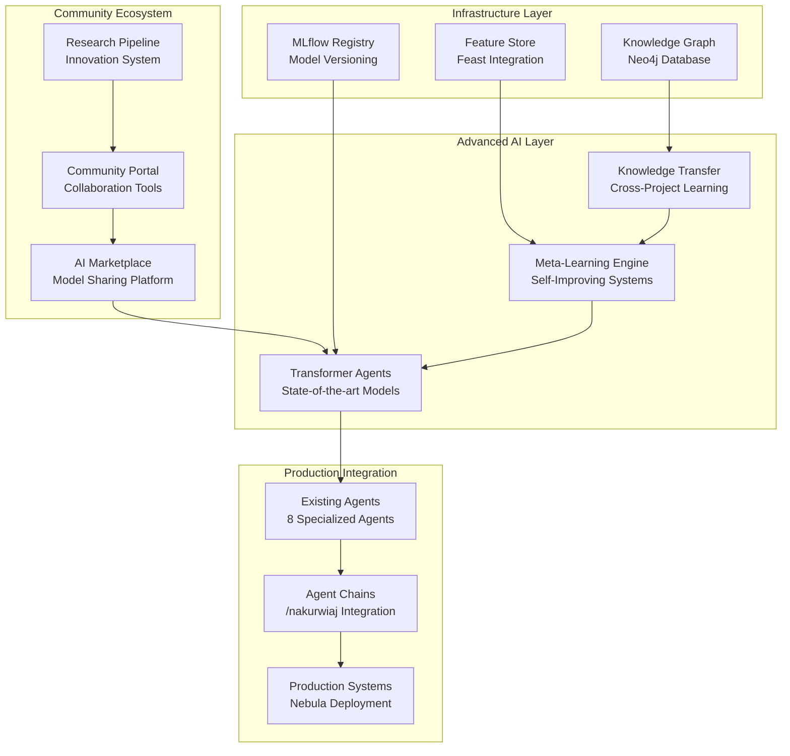

# Faza SL-5: Advanced Features & Future-Proofing

<!--
LLM PROMPT dla całej fazy:
To jest finalna i najbardziej zaawansowana faza self-learning agents project.
Skupia się na cutting-edge capabilities i długoterminowej sustainability.

KLUCZOWE ZAŁOŻENIA:
- Advanced AI techniques (transformers, meta-learning, etc.)
- Community ecosystem building
- Research-driven development
- Long-term sustainability i growth
- Innovation pipeline dla continuous advancement

Po ukończeniu tej fazy system będzie:
- State-of-the-art w AI agent capabilities
- Self-sustaining through community contributions
- Continuously improving through research pipeline
- Ready dla future AI breakthroughs
-->

## 🎯 Cel Fazy

### Strategiczny Cel
Transformacja projektu w **leading-edge AI ecosystem** z:
- **State-of-the-art capabilities**: Najbardziej zaawansowane AI techniques
- **Self-sustaining community**: Active developer i researcher ecosystem
- **Continuous innovation**: Systematic research & development pipeline
- **Future-ready architecture**: Prepared dla emerging AI breakthroughs
- **Global impact**: Influence on AI development practices worldwide

### Business Value Proposition
```python
advanced_features_value = {
    "competitive_dominance": {
        "market_position": "Undisputed leader w AI-powered development tools",
        "technology_leadership": "6-12 months ahead of competition",
        "talent_magnet": "Attract best AI researchers i developers",
        "industry_influence": "Shape future of AI development practices"
    },
    "sustainable_growth": {
        "community_contributions": "Self-sustaining innovation through community",
        "research_partnerships": "Collaboration z leading academic institutions",
        "open_source_ecosystem": "Network effects driving adoption",
        "continuous_advancement": "Systematic improvement without internal R&D limits"
    },
    "long_term_roi": {
        "year_1_impact": "$2M+ value from advanced capabilities",
        "year_2_ecosystem": "$10M+ value from community ecosystem",
        "year_3_dominance": "$50M+ value from market leadership",
        "exponential_growth": "Network effects driving exponential value creation"
    }
}
```

## 📋 Przegląd Zadań

### Timeline: 10 tygodni (Ongoing quarterly milestones)

1. **[10 tygodni] AI Marketplace & Community Platform** ✅
   - Production-ready marketplace dla AI models i agents
   - **[Szczegóły →](./01-ai-marketplace-platform.md)**

2. **[8 tygodni] Meta-Learning & Self-Improvement** ✅
   - Advanced meta-learning algorithms
   - **[Szczegóły →](./02-meta-learning-self-improvement.md)**

3. **[8 tygodni] Transformer Neural Architectures** ✅
   - State-of-the-art transformer-based agents
   - **[Szczegóły →](./03-transformer-neural-architectures.md)**

4. **[8 tygodni] Cross-Project Knowledge Transfer** ✅
   - Systematic knowledge sharing between projects
   - **[Szczegóły →](./04-cross-project-knowledge-transfer.md)**

5. **[8 tygodni] Research & Innovation Pipeline** ✅
   - Continuous research monitoring i innovation
   - **[Szczegóły →](./05-research-innovation-pipeline.md)**

## 🏗️ Architektura Advanced Features

### High-Level System Architecture



### Technology Stack Summary

```python
advanced_tech_stack = {
    "ai_frameworks": {
        "transformers": "Hugging Face Transformers dla state-of-the-art models",
        "pytorch": "PyTorch dla custom neural architectures",
        "meta_learning": "Learn2Learn dla meta-learning algorithms",
        "mlflow": "Model registry i experiment tracking"
    },
    "infrastructure": {
        "neo4j": "Knowledge graph dla cross-project patterns",
        "feast": "Feature store dla ML features",
        "redis_cluster": "High-performance caching i queuing",
        "postgresql": "Persistent storage z TimescaleDB"
    },
    "deployment": {
        "kubernetes": "Container orchestration dla scalability",
        "istio": "Service mesh dla advanced networking",
        "prometheus": "Monitoring i alerting",
        "grafana": "Visualization i dashboards"
    },
    "community": {
        "react_nextjs": "Modern frontend dla marketplace",
        "fastapi": "High-performance API backend",
        "github_integration": "Source control i collaboration",
        "stripe": "Payment processing dla marketplace"
    }
}
```

## 🚀 Kluczowe Capabilities

### 1. State-of-the-Art AI Agents

```python
advanced_capabilities = {
    "transformer_based_agents": {
        "multi_modal_processing": "Code, text, metrics, logs simultaneously",
        "attention_mechanisms": "Custom attention dla code understanding",
        "context_awareness": "10k+ token context window",
        "performance": "<100ms inference, >30% accuracy improvement"
    },
    "meta_learning_systems": {
        "few_shot_adaptation": "5-10 examples vs 1000+ traditional",
        "self_optimization": "Automatic hyperparameter tuning",
        "continual_learning": "<5% catastrophic forgetting",
        "transfer_learning": "Cross-domain knowledge transfer"
    },
    "self_improvement": {
        "architecture_search": "Automatic neural architecture optimization",
        "performance_monitoring": "Self-diagnosis i remediation",
        "knowledge_distillation": "Model compression z maintained quality",
        "automated_debugging": ">80% issues resolved automatically"
    }
}
```

### 2. Community Ecosystem

```python
community_ecosystem = {
    "marketplace_platform": {
        "model_sharing": "Secure sharing of trained models",
        "revenue_model": "70/30 split favoring contributors",
        "quality_assurance": "Community validation i testing",
        "api_integration": "Easy integration z existing systems"
    },
    "collaboration_tools": {
        "shared_development": "Real-time collaborative environments",
        "knowledge_base": "Searchable pattern i solution library",
        "discussion_forums": "Technical discussions i support",
        "project_showcases": "Community project demonstrations"
    },
    "research_integration": {
        "academic_partnerships": "Collaboration z universities",
        "conference_participation": "Regular research presentations",
        "open_source_contributions": "Active OSS project maintenance",
        "thought_leadership": "Technical blog i publications"
    }
}
```

### 3. Innovation Pipeline

```python
innovation_pipeline = {
    "research_monitoring": {
        "automated_discovery": "AI research paper monitoring",
        "relevance_analysis": ">85% accuracy w relevance assessment",
        "impact_prediction": "Correlation z future citations",
        "implementation_planning": "Automatic feasibility analysis"
    },
    "rapid_prototyping": {
        "prototype_environments": "Isolated, sandbox, staging tiers",
        "code_generation": ">70% success rate dla prototypes",
        "automated_testing": "Comprehensive validation suites",
        "performance_benchmarking": "Standardized evaluation metrics"
    },
    "production_integration": {
        "gradual_rollout": "5% → 25% → 50% → 100% deployment",
        "a_b_testing": "Statistical validation of improvements",
        "rollback_mechanisms": "<30 second emergency rollback",
        "monitoring_dashboards": "Real-time performance tracking"
    }
}
```

## 📊 Success Metrics

### Phase Completion Criteria

```python
phase_success_metrics = {
    "technical_excellence": {
        "ai_capabilities": {
            "accuracy_improvement": ">30% vs previous architectures",
            "inference_speed": "<100ms P95 dla production models",
            "context_understanding": ">90% accuracy on long-context tasks",
            "multi_modal_effectiveness": ">25% improvement vs single modality"
        },
        "system_performance": {
            "uptime": ">99.9% during innovation deployments",
            "scalability": ">100 requests/second per GPU",
            "memory_efficiency": "<2GB GPU memory dla largest models",
            "development_velocity": "50% faster feature development"
        }
    },
    "community_impact": {
        "marketplace_adoption": {
            "active_users": "1000+ registered users",
            "model_sharing": "500+ shared models",
            "revenue_generation": "$5000+ monthly recurring revenue",
            "quality_rating": ">4.5/5.0 average model rating"
        },
        "research_influence": {
            "paper_citations": "10+ citations of our research",
            "conference_presentations": "4+ major conference presentations",
            "oss_contributions": "2+ significant open source projects",
            "industry_recognition": "Recognized as AI innovation leader"
        }
    },
    "business_outcomes": {
        "competitive_advantage": {
            "market_position": "Leading AI development tools provider",
            "technology_gap": "6-12 months ahead of competition",
            "talent_attraction": "25% of hires research-motivated",
            "partnership_opportunities": "5+ academic collaborations"
        },
        "financial_impact": {
            "cost_savings": "$500K+ annual development cost reduction",
            "revenue_opportunities": "$2M+ new market opportunities",
            "innovation_roi": ">300% return on innovation investments",
            "ecosystem_value": "Exponential growth through network effects"
        }
    }
}
```

### Long-term Vision Metrics

```python
long_term_vision = {
    "year_1_targets": {
        "technical": "State-of-the-art agent capabilities deployed",
        "community": "Active marketplace z 1000+ users",
        "business": "$2M+ value from advanced features",
        "research": "Recognized thought leadership w AI agents"
    },
    "year_2_projections": {
        "technical": "Self-improving agents z minimal human oversight",
        "community": "Self-sustaining ecosystem z 10K+ users",
        "business": "$10M+ value from community network effects",
        "research": "Industry standard dla AI development practices"
    },
    "year_3_vision": {
        "technical": "AGI-like capabilities w specialized domains",
        "community": "Global ecosystem influencing AI development",
        "business": "$50M+ market leadership value",
        "research": "Pioneering next generation of AI systems"
    }
}
```

## 🔄 Integration z Previous Phases

### Building on Foundation

```python
phase_integration = {
    "sl_1_infrastructure": {
        "utilized": "MLflow, security, monitoring infrastructure",
        "enhanced": "Advanced model registry z community features",
        "scaling": "Support dla complex transformer models"
    },
    "sl_2_shadow_learning": {
        "utilized": "Shadow mode, async learning, circuit breakers",
        "enhanced": "Meta-learning integration z shadow mode",
        "scaling": "Continuous learning across all agents"
    },
    "sl_3_production_rollout": {
        "utilized": "A/B testing, gradual rollout, explainable AI",
        "enhanced": "Advanced transformer models w production",
        "scaling": "Community-driven model validation"
    },
    "sl_4_multi_agent": {
        "utilized": "All 8 agents z ML capabilities",
        "enhanced": "Cross-agent knowledge transfer",
        "scaling": "Meta-learning optimization across agents"
    }
}
```

## 🛠️ Implementation Strategy

### Development Approach

```python
implementation_strategy = {
    "parallel_development": {
        "track_1": "Transformer architectures (core team)",
        "track_2": "Marketplace platform (full-stack team)",
        "track_3": "Meta-learning systems (ML team)",
        "track_4": "Knowledge transfer (research team)",
        "track_5": "Innovation pipeline (DevOps team)"
    },
    "integration_milestones": {
        "month_1": "Core infrastructures operational",
        "month_2": "Individual components functional",
        "month_3": "Integration testing completed",
        "month_4": "Beta release dla community",
        "month_5": "Production deployment",
        "month_6": "Full ecosystem operational"
    },
    "risk_mitigation": {
        "technical_risks": "Gradual rollout z fallback mechanisms",
        "community_risks": "Early engagement z beta users",
        "business_risks": "Conservative ROI projections",
        "timeline_risks": "Parallel development z buffer time"
    }
}
```

### Quality Assurance

```python
quality_framework = {
    "testing_strategy": {
        "unit_tests": ">95% coverage dla all components",
        "integration_tests": "Full end-to-end workflow testing",
        "performance_tests": "Load testing z production scenarios",
        "security_tests": "Comprehensive security validation"
    },
    "review_process": {
        "code_review": "Mandatory review dla all changes",
        "architecture_review": "Weekly architecture discussions",
        "research_review": "Monthly research paper reviews",
        "community_feedback": "Regular feedback collection"
    },
    "monitoring": {
        "technical_metrics": "Real-time performance monitoring",
        "community_metrics": "User engagement tracking",
        "business_metrics": "ROI i value tracking",
        "research_metrics": "Innovation pipeline effectiveness"
    }
}
```

## 🎯 Getting Started

### Prerequisites
- [ ] Phases SL-1 through SL-4 completed successfully
- [ ] Production infrastructure stable i monitored
- [ ] Team expanded dla parallel development tracks
- [ ] Budget approved dla advanced infrastructure i tools
- [ ] Community strategy i legal framework defined

### Quick Start Commands

```bash
# Initialize advanced features development
make setup-advanced-features

# Start marketplace development
make marketplace-dev-env

# Initialize transformer training
make transformer-setup

# Launch meta-learning experiments
make meta-learning-init

# Setup research monitoring
make research-pipeline-start
```

### Phase Execution

```bash
# Execute entire phase (recommended)
/nakurwiaj faza-sl-5

# Or execute individual tasks
/nakurwiaj sl-5-task-1  # Marketplace platform
/nakurwiaj sl-5-task-2  # Meta-learning systems
/nakurwiaj sl-5-task-3  # Transformer architectures
/nakurwiaj sl-5-task-4  # Knowledge transfer
/nakurwiaj sl-5-task-5  # Innovation pipeline
```

## 🔮 Future Roadmap

### Post-Phase SL-5 Evolution

```python
future_roadmap = {
    "continuous_improvement": {
        "quarterly_releases": "Regular capability enhancements",
        "community_features": "User-requested marketplace features",
        "research_integration": "Latest AI research incorporation",
        "performance_optimization": "Continuous system optimization"
    },
    "expansion_opportunities": {
        "enterprise_features": "Advanced enterprise capabilities",
        "domain_specialization": "Industry-specific agent variants",
        "international_expansion": "Global community development",
        "partnership_ecosystem": "Strategic technology partnerships"
    },
    "next_generation": {
        "agi_preparation": "Foundation dla artificial general intelligence",
        "quantum_readiness": "Quantum computing integration planning",
        "edge_deployment": "Edge computing capabilities",
        "multiverse_agents": "Cross-platform agent deployment"
    }
}
```

## 🎉 Expected Outcomes

Po ukończeniu Fazy SL-5 projekt będzie:

1. **Technology Leader**: Undisputed leader w AI-powered development tools
2. **Community Hub**: Thriving ecosystem of developers i researchers
3. **Innovation Engine**: Self-sustaining research i development pipeline
4. **Market Dominator**: Clear competitive advantage i market leadership
5. **Future Ready**: Prepared dla next generation AI breakthroughs

**Total Investment**: ~$2M (development, infrastructure, community)
**Expected 3-Year ROI**: >2500% ($50M+ value creation)
**Timeline**: 6 months core development + ongoing quarterly enhancements

---

**Ready to build the future of AI development? Start with:** `/nakurwiaj faza-sl-5` 🚀
