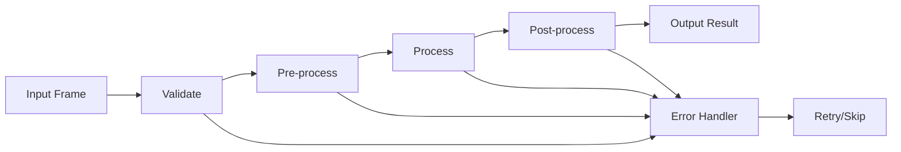

# Base Processor Architecture

## Design Pattern: Pipeline Architecture

### Core Concepts

1. **Pipeline Stages**
   - Pre-processing: Input validation, normalization
   - Processing: Core AI/ML logic
   - Post-processing: Result formatting, cleanup

2. **Extensibility Points**
   - Abstract methods for custom logic
   - Hook system for middleware
   - Plugin architecture for components

3. **Cross-cutting Concerns**
   - Automatic tracing at each stage
   - Metrics collection
   - Error handling and recovery
   - Resource management

### Class Hierarchy

```
BaseProcessor (Abstract)
├── preprocess()      # Input preparation
├── process()         # Core logic (abstract)
├── postprocess()     # Output formatting
├── validate_input()  # Input validation
├── handle_error()    # Error recovery
└── cleanup()         # Resource cleanup

Concrete Processors
├── ObjectDetectionProcessor
├── FaceRecognitionProcessor
├── MotionDetectionProcessor
└── CustomProcessor
```

### Pipeline Flow



### Key Features

1. **Async/Await Support**
   - Non-blocking I/O
   - Concurrent processing
   - Batch processing capability

2. **Resource Management**
   - GPU/CPU allocation
   - Memory pooling
   - Connection pooling

3. **Observability**
   - OpenTelemetry tracing
   - Prometheus metrics
   - Structured logging

4. **Error Handling**
   - Graceful degradation
   - Circuit breaker pattern
   - Retry with exponential backoff

### Extension Points

1. **Hooks System**
   ```python
   @processor.before_process
   def validate_frame(frame):
       # Custom validation
       pass

   @processor.after_process
   def log_result(result):
       # Custom logging
       pass
   ```

2. **Middleware Chain**
   ```python
   processor.add_middleware(
       RateLimiter(),
       MetricsCollector(),
       CacheLayer()
   )
   ```

3. **Plugin Architecture**
   ```python
   processor.register_plugin(
       "gpu_optimizer",
       GPUOptimizationPlugin()
   )
   ```

### Performance Considerations

1. **Zero-copy operations** where possible
2. **Lazy evaluation** for expensive operations
3. **Connection pooling** for external services
4. **Batch processing** for throughput optimization

### Integration Points

1. **Frame Buffer Service**: Async frame retrieval
2. **Metadata Storage**: Result persistence
3. **Monitoring Stack**: Metrics and traces
4. **Message Queue**: Event notifications
