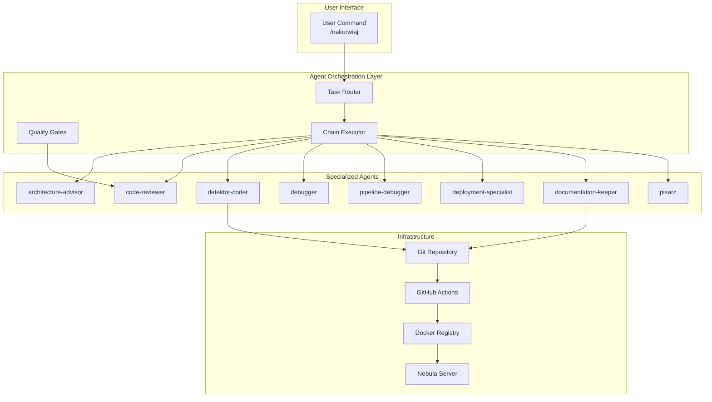

# System Architecture - AI Agents in Detektor

## 🏗️ High-Level Architecture

### Agent Ecosystem Overview


## 🔄 Agent Communication Architecture

### Message Bus Pattern
```
┌─────────────────────────────────────────────────────────┐
│                    Event Bus (Redis)                     │
├─────────────────────────────────────────────────────────┤
│  Channels:                                              │
│  - agent.detektor-coder                                 │
│  - agent.code-reviewer                                  │
│  - agent.deployment-specialist                          │
│  - agent.documentation-keeper                           │
│  - ...                                                  │
└─────────────────────────────────────────────────────────┘
         ↑                    ↑                    ↑
         │                    │                    │
    ┌────┴────┐         ┌────┴────┐         ┌────┴────┐
    │ Agent 1 │         │ Agent 2 │         │ Agent 3 │
    └─────────┘         └─────────┘         └─────────┘
```

### Agent Task Flow
```
Task Input → Classification → Primary Agent → Execution
                                    ↓
                              Quality Gate
                                    ↓
                            Review Agent → [Pass/Fail]
                                              ↓
                                    [Fail] → Fix Loop
                                              ↓
                                    [Pass] → Next Agent
                                              ↓
                                         Documentation
                                              ↓
                                          Deployment
```

## 🧠 Agent Intelligence Architecture

### Decision Making Framework
```python
class AgentBrain:
    """Core decision-making framework for agents."""

    def __init__(self, agent_type: str):
        self.agent_type = agent_type
        self.knowledge_base = self.load_knowledge()
        self.decision_tree = self.build_decision_tree()

    def analyze_task(self, task: Task) -> Decision:
        """Analyze task and make decision."""
        # Extract features
        features = self.extract_features(task)

        # Navigate decision tree
        decision = self.decision_tree.predict(features)

        # Apply agent-specific logic
        return self.apply_expertise(decision)
```

### Knowledge Representation
```yaml
Agent Knowledge Base:
  detektor-coder:
    patterns:
      - Clean Architecture principles
      - TDD methodology
      - FastAPI best practices
      - Python 3.11+ features

    rules:
      - "Always write tests first"
      - "100% type hint coverage"
      - "No hardcoded values"

    examples:
      - Previous successful implementations
      - Common patterns in codebase

  code-reviewer:
    checklists:
      - SOLID principles
      - Security vulnerabilities
      - Performance bottlenecks

    metrics:
      - Cyclomatic complexity < 10
      - Function length < 20 lines
      - Test coverage > 80%
```

## 🏛️ Detektor System Architecture

### Microservices Architecture
```
┌─────────────────────────────────────────────────────────────┐
│                     External Systems                         │
│  ┌─────────────┐  ┌─────────────┐  ┌──────────────┐       │
│  │ Camera (IP) │  │Home Assistant│  │ LLM APIs     │       │
│  └──────┬──────┘  └──────┬──────┘  └──────┬───────┘       │
└─────────┼────────────────┼─────────────────┼───────────────┘
          │                │                 │
┌─────────┼────────────────┼─────────────────┼───────────────┐
│         ▼                ▼                 ▼               │
│  ┌─────────────┐  ┌─────────────┐  ┌──────────────┐      │
│  │RTSP Capture │  │ HA Bridge   │  │Intent Service│      │
│  │  Port:8080  │  │  Port:8004  │  │  Port:8010  │      │
│  └──────┬──────┘  └──────┬──────┘  └──────┬───────┘      │
│         │                │                 │               │
│         ▼                ▼                 ▼               │
│  ┌────────────────────────────────────────────────┐       │
│  │           Redis Streams (Event Bus)            │       │
│  │                 Port: 6379                     │       │
│  └────────────────────────────────────────────────┘       │
│         │                                  │               │
│         ▼                                  ▼               │
│  ┌─────────────┐                   ┌──────────────┐      │
│  │Frame Buffer │                   │Frame Tracking│      │
│  │  Port:8002  │                   │  Port:8001  │      │
│  └──────┬──────┘                   └──────────────┘      │
│         │                                                  │
│         ▼                                                  │
│  ┌─────────────────────────────────────────┐             │
│  │         Processing Pipeline              │             │
│  │  ┌────────┐ ┌────────┐ ┌────────────┐ │             │
│  │  │Object  │ │Face    │ │Gesture     │ │             │
│  │  │Detect  │ │Recogn. │ │Detection   │ │             │
│  │  │:8003   │ │:8006   │ │:8007       │ │             │
│  │  └────────┘ └────────┘ └────────────┘ │             │
│  └─────────────────────────────────────────┘             │
│         │                                                  │
│         ▼                                                  │
│  ┌──────────────┐     ┌─────────────────────────┐       │
│  │Metadata Store│     │   Observability Stack   │       │
│  │  Port:8005   │     │ Prometheus: 9090        │       │
│  │  PostgreSQL  │     │ Grafana: 3000          │       │
│  └──────────────┘     │ Jaeger: 16686          │       │
│                       └─────────────────────────┘       │
└───────────────────────────────────────────────────────────┘
```

### Data Flow Architecture
```
Frame Journey:
1. Camera → RTSP Capture (8080)
   - Generates FrameID
   - Creates trace context
   - Publishes to Redis Stream

2. Redis Stream → Frame Buffer (8002)
   - SharedFrameBuffer pattern
   - In-memory queueing
   - Backpressure handling

3. Frame Buffer → Processors
   - Parallel processing
   - Trace propagation
   - Result aggregation

4. Processors → Metadata Storage (8005)
   - PostgreSQL/TimescaleDB
   - Full trace history
   - Query capabilities

5. Events → Home Assistant Bridge (8004)
   - Action execution
   - State updates
   - Automation triggers
```

## 🔐 Security Architecture

### Agent Security Model
```yaml
Security Layers:
  1. Authentication:
     - Agent API keys
     - GitHub token for deployments
     - SOPS for secrets

  2. Authorization:
     - Role-based agent permissions
     - Repository access control
     - Deployment restrictions

  3. Audit:
     - All agent actions logged
     - Git commit trail
     - Deployment history

  4. Isolation:
     - Agents run in containers
     - Network segmentation
     - Resource limits
```

## 📊 Monitoring Architecture

### Agent Performance Monitoring
```
┌─────────────────────────────────────────┐
│          Prometheus Metrics             │
├─────────────────────────────────────────┤
│ agent_task_duration_seconds             │
│ agent_task_success_total                │
│ agent_review_iterations                 │
│ agent_deployment_success_rate           │
└─────────────────────────────────────────┘
                    │
                    ▼
┌─────────────────────────────────────────┐
│         Grafana Dashboards              │
├─────────────────────────────────────────┤
│ - Agent Performance Overview            │
│ - Task Completion Times                 │
│ - Review Cycle Analytics                │
│ - Deployment Success Rates              │
└─────────────────────────────────────────┘
```

### Distributed Tracing
```
┌─────────────────────────────────────────┐
│            Jaeger UI                    │
├─────────────────────────────────────────┤
│ Trace: Task Execution                   │
│                                         │
│ ├─ agent.router (100ms)                │
│ ├─ agent.detektor-coder (4m 20s)      │
│ ├─ agent.code-reviewer (1m 10s)       │
│ ├─ agent.detektor-coder.fix (2m 30s)  │
│ ├─ agent.code-reviewer.verify (30s)   │
│ ├─ git.operations (45s)               │
│ ├─ agent.deployment (3m 15s)          │
│ └─ agent.documentation (2m)            │
└─────────────────────────────────────────┘
```

## 🚀 Deployment Architecture

### CI/CD Pipeline with Agents
```
Developer Push
      │
      ▼
GitHub Actions
      │
      ├─→ Code Analysis
      │   └─→ agent.code-reviewer
      │
      ├─→ Test Execution
      │   └─→ Parallel test suites
      │
      ├─→ Build & Package
      │   └─→ Multi-stage Docker
      │
      ├─→ Push to Registry
      │   └─→ ghcr.io/hretheum/detektr/
      │
      └─→ Deploy
          └─→ agent.deployment-specialist
              │
              ├─→ Pull images on Nebula
              ├─→ Update services
              ├─→ Health checks
              └─→ Rollback if needed
```

### Container Orchestration
```yaml
Docker Compose Structure:
  /docker/
    ├── base/
    │   ├── docker-compose.yml      # Core services
    │   ├── docker-compose.infra.yml # Infrastructure
    │   └── docker-compose.ai.yml    # AI services
    │
    ├── environments/
    │   ├── production.yml
    │   ├── staging.yml
    │   └── development.yml
    │
    └── features/
        ├── monitoring.yml
        └── gpu.yml
```

## 🧩 Integration Architecture

### Agent Integration Points
```python
# Integration with existing codebase
class AgentIntegration:
    """How agents integrate with the project."""

    integration_points = {
        "git_hooks": {
            "pre-commit": "code-reviewer validation",
            "post-commit": "documentation sync",
        },

        "api_endpoints": {
            "/agent/execute": "Task execution API",
            "/agent/status": "Agent health checks",
            "/agent/metrics": "Performance metrics",
        },

        "event_streams": {
            "task.created": "New task notification",
            "review.completed": "Review results",
            "deployment.status": "Deploy updates",
        },

        "cli_commands": {
            "/nakurwiaj": "Execute block",
            "/agent": "Direct agent invocation",
            "/status": "Check agent status",
        }
    }
```

## 🔮 Future Architecture Enhancements

### Planned Improvements
1. **Agent Mesh Network**
   - Direct agent-to-agent communication
   - Reduced latency
   - Fault tolerance

2. **Federated Learning**
   - Agents learn from each other
   - Shared knowledge base
   - Continuous improvement

3. **Multi-Cloud Deployment**
   - Agents across regions
   - Global task distribution
   - Disaster recovery

4. **AI-Driven Scaling**
   - Predictive agent spawning
   - Resource optimization
   - Cost management
